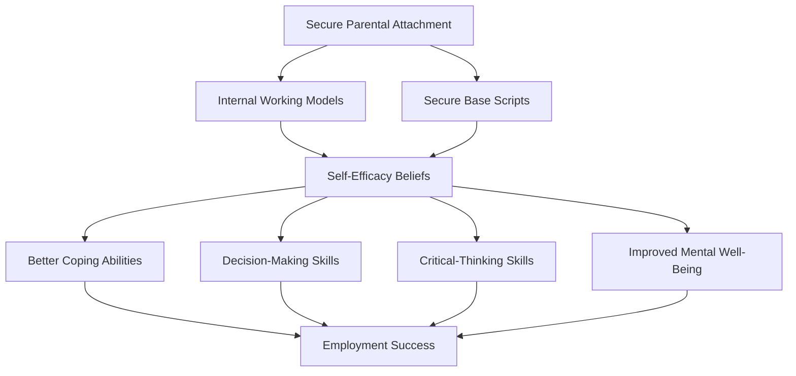

# Psychology-Driven Parenting and Career Outcomes: A Theoretical Synthesis of Self-Determination Theory and Attachment Theory

---

## Introduction

Parenting practices constitute one of the most consequential environmental factors shaping children's developmental trajectories, with effects that extend far beyond immediate behavioral outcomes to influence long-term career success and occupational attainment. Contemporary psychological research has identified two complementary theoretical frameworks—Self-Determination Theory (SDT) and Attachment Theory—that explain the mechanisms through which parenting behaviors translate into career-relevant psychological capacities. These frameworks converge on a central thesis: **early relational experiences with caregivers establish internal working models and basic psychological needs that subsequently shape motivation, self-efficacy, and vocational exploration behaviors throughout the lifespan**. Understanding these mechanisms is essential for developing evidence-based parenting interventions that promote optimal career development outcomes.

This report synthesizes the theoretical and empirical foundations of both SDT and Attachment Theory, explicates the causal chains linking parenting practices to career outcomes, and identifies critical mediating variables that transmit these effects. The analysis draws upon meta-analytic evidence, longitudinal studies, and systematic reviews to establish quantitative benchmarks for the relationships under examination.

---

## Self-Determination Theory: Foundational Principles

### The Three Basic Psychological Needs

**Self-Determination Theory identifies three innate psychological needs—autonomy, competence, and relatedness—that function as essential nutrients for optimal human functioning and development** [Ryan & Deci, 2000]. When social contexts, including parenting environments, satisfy these needs, individuals develop intrinsic motivation, psychological well-being, and adaptive behavioral patterns; when these needs are thwarted, motivation diminishes and maladaptive outcomes emerge.

The need for **competence** refers to the drive to feel effective in one's interactions with the environment and to exercise one's capacities. Children develop competence through experiences of mastery within appropriately challenging contexts—situations that offer stretch without overwhelming. Parental behaviors that foster competence include providing tasks calibrated to the child's developmental level, offering constructive feedback that emphasizes effort over fixed ability, and celebrating progress rather than solely outcome.

**Autonomy** reflects the need for volition, self-endorsement of one's actions, and the experience that one's behavior originates from the self rather than being externally imposed. Autonomy-supportive parenting involves acknowledging children's feelings and perspectives, encouraging initiative, offering meaningful choices within appropriate limits, and minimizing controlling, coercive, or manipulative disciplinary approaches. Critically, autonomy support does not mean permissiveness—it involves setting limits while explaining the rationale for boundaries and respecting the child's internal motivation.

**Relatedness** encompasses the need for warm, satisfying connections with others characterized by care, acceptance, and belonging. Within the family context, relatedness manifests through emotional warmth, physical affection, attunement to the child's emotional states, and the creation of an environment where the child feels unconditionally valued. Secure relational bonds within the family provide a foundation for healthy relationships throughout life.

### Causal Mechanisms: From Need Satisfaction to Career Outcomes

The causal pathway from SDT-based parenting to career outcomes operates through multiple interconnected mechanisms. **Social contexts that support the three basic psychological needs facilitate the development of autonomous (self-authored) motivation, which produces more sustained engagement, deeper learning, and greater resilience in the face of challenges** [Ryan & Deci, 2000].

| Need | Parental Behavior | Mechanism | Career Outcome |
|------|-------------------|-----------|----------------|
| **Competence** | Scaffolding challenging tasks | Mastery experiences → self-efficacy beliefs | Occupational performance |
| **Autonomy** | Choice provision, rationale explanation | Internalization of values → career commitment | Career persistence |
| **Relatedness** | Emotional warmth, acceptance | Secure relational base → reduced anxiety | Vocational exploration |

The developmental sequence operates as follows: When parents provide autonomy support, children internalize values and regulations, developing authentic rather than controlled motivation. This authentic motivation manifests as increased interest, excitement, and confidence during career-relevant activities [Ryan & Deci, 2000]. The positive emotional associations with autonomous action create approach orientations toward career challenges rather than avoidance responses.

Competence experiences within the family context directly shape self-efficacy beliefs—domain-specific beliefs about one's capability to perform successfully. Self-efficacy, in turn, predicts career aspiration levels, educational attainment, and occupational choice. Research on self-efficacy theory demonstrates that efficacy beliefs operate through four primary mechanisms: cognitive processes (goal-setting and mental simulation), motivational processes (effort allocation and persistence), affective processes (stress reduction and anxiety management), and selection processes (career pathway choices) [Umucu & Chan, 2016].

### Meta-Analytic Evidence: Quantifying SDT Intervention Effects

A systematic review and meta-analysis of 36 SDT-based intervention studies comprising 11,792 participants provides robust quantitative evidence for the theory's predictions [Wang, Wang, et al., 2024]. The meta-analysis extracted 137 effect sizes from studies employing experimental or quasi-experimental designs, enabling precise estimation of intervention magnitudes.

| Variable | Design Type | Effect Size (Hedges' g) | p-value | Interpretation |
|----------|-------------|------------------------|---------|-----------------|
| **Autonomy** | Experimental/Quasi-experimental | 1.14 | < 0.0001 | Large effect |
| **Autonomy** | Pre-post designs | 0.19 | < 0.01 | Small effect |
| **Competence** | Experimental/Quasi-experimental | 0.48 | < 0.05 | Moderate effect |
| **Competence** | Pre-post designs | 0.58 | < 0.05 | Moderate effect |
| **Intrinsic motivation** | Experimental/Quasi-experimental | 0.58 | < 0.01 | Moderate effect |
| **Relatedness** | Experimental/Quasi-experimental | 0.44 | p > 0.05 | Not significant |

These results consistently support the predictions that autonomy and competence interventions produce meaningful improvements in psychological need satisfaction and intrinsic motivation [Wang, Wang, et al., 2024]. The autonomy effect size of g = 1.14 in controlled designs represents a particularly large effect, indicating that autonomy-supportive interventions produce substantial improvements in autonomous motivation relative to control conditions. The non-significant relatedness finding may reflect the relatively brief duration of most educational interventions, as relatedness typically requires longer relational formation periods.

Critically, the meta-analysis demonstrates that SDT-based interventions enhance both academic motivation and performance while benefiting students' overall development and well-being [Wang, Wang, et al., 2024]. This convergence of motivational and well-being outcomes addresses a persistent concern that performance-focused interventions may come at psychological costs—a concern that SDT-based approaches appear to resolve through their emphasis on need satisfaction rather than performance pressure alone.

### The Transition from Extrinsic to Intrinsic Motivation

**A critical developmental transition occurs when children move from externally regulated behavior to integrated, self-authored motivation—a process that parenting practices directly influence through their autonomy-supportive quality** [Ryan & Deci, 2000]. This motivational internalization process operates along a continuum from external regulation (behavior controlled by external demands) through introjected regulation (behavior motivated by internal pressures such as guilt or ego involvement), identified regulation (behavior valued as personally important), to integrated regulation (behavior fully assimilated into the self).

Parents who rely exclusively on extrinsic incentives, punishment contingencies, and controlling communication tend to anchor motivation at the external or introjected levels. Children operating from these motivational orientations demonstrate what appears to be compliant behavior but lack genuine engagement and are vulnerable to motivation collapse when external controls are removed. In contrast, parents who provide rationales for expectations, acknowledge resistance, offer choice within structure, and minimize controlling language facilitate the internalization process, enabling children to develop integrated motivation that supports sustained career engagement.

---

## Attachment Theory: Internal Working Models and Career Development

### Secure Attachment as a Foundation for Career Exploration

**Attachment Theory provides a complementary framework for understanding how early relational experiences establish internal working models that shape career development trajectories across the lifespan** [Bowlby, 1951, 1969; iResearchNet]. Secure attachment—developed through consistent, responsive caregiving during infancy and childhood—creates cognitive-affective schemas that function as prototypes for understanding relationships, managing emotional challenges, and approaching novel situations, including career exploration tasks.

The foundational concept of the **secure base**, introduced by Bowlby, describes how healthy attachment relationships serve dual functions: enabling the child to venture forth and explore the environment from a reliable home base, and providing a safe haven to which the child can return for emotional support when distressed [Bowlby, 1969/1982]. This bidirectional function maps directly onto career development processes, which require both exploration (venturing forth) and emotional regulation during setbacks (seeking comfort and recalibration).

Research consistently demonstrates that attachment security is positively related to:

- Degree of vocational exploration [iResearchNet]
- Career decision-making quality
- Educational and career aspirations
- Effective developmental transitions

For adolescent girls specifically, secure attachment to both parents was positively related to both the frequency and diversity of exploratory activities [iResearchNet]. This gender-specific finding aligns with broader research indicating that girls may be particularly responsive to relational influences on career development, though the underlying mechanisms likely operate bidirectionally across genders.

### Internal Working Models: The Cognitive Architecture of Career Readiness

**Beginning in the first year of life, mentally healthy individuals develop mental representations termed 'internal working models' (IWMs) that encode expectations about self, others, and relationships based on caregiving experiences** [Bowlby, 1969/1982; Bretherton, 1991]. These IWMs function as the 'building blocks' from which individuals construct their understanding of how attachment-related events typically unfold.

Securely attached children develop what researchers term a **'secure base script'**—a causal-temporal prototype of how attachment relationships function [Bretherton, 1991]. The typical script follows a predictable sequence: "When I am hurt or distressed, I go to my caregiver, my caregiver responds with comfort and assistance, my distress diminishes, and I can return to comfortable engagement with my environment." This script provides a cognitive framework for understanding challenge-response sequences that applies broadly beyond literal attachment contexts.

In contrast, insecure individuals may exhibit gaps in their secure base scripts, distorted representations of how support operates, or even complete absence of coherent attachment narratives [Bretherton, 1991]. These insecure working models create vulnerability to career-relevant difficulties: anxiety during exploration, excessive dependency on external validation, avoidance of career risks, or conversely, premature closure driven by fear of commitment.

### Self-Efficacy as a Mediator: The Causal Pathway

Research has established **self-efficacy as a significant mediator of the relationship between secure attachment and career outcomes**, explaining the mechanism through which early attachment experiences translate into employment success [Umucu & Chan, 2016]. This finding holds critical implications for understanding how parenting practices influence long-term career trajectories.

The causal chain operates through multiple pathways [Umucu & Chan, 2016]:

1. **Cognitive pathway**: Secure attachment fosters coherent self-models characterized by worthiness and capability, which provide the cognitive foundation for efficacy beliefs across domain-specific tasks.

2. **Emotional regulation pathway**: Securely attached individuals develop superior capacity to manage anxiety and stress during challenging career tasks, preserving the cognitive resources necessary for effective performance.

3. **Relational learning pathway**: Early experiences with responsive caregivers provide prototypes for seeking and utilizing support in educational and workplace contexts.

4. **Exploration facilitation pathway**: The felt security provided by secure attachment enables the risk-taking necessary for career experimentation and exploration.

### Longitudinal Evidence: From High School to Career

**Parental attachment at the end of high school predicts positive changes in expectations of support and socio-emotional adjustment across the transition to college, directly impacting subsequent career trajectory** [iResearchNet]. This longitudinal finding demonstrates that attachment security operates as a developmental resource whose effects accumulate across educational and occupational transitions.

For female high school seniors specifically, attachment to mother during high school contributed to career aspirations five years later, but the effect was fully mediated through career self-efficacy [iResearchNet]. This mediation finding is particularly significant because it identifies self-efficacy as the operative mechanism through which relational security translates into career-relevant ambition. The implication is that parenting interventions targeting attachment security may need to specifically address the development of self-efficacy beliefs to maximize career impact.

Research examining individuals with spinal cord injuries found that approximately half of adults are securely attached, and the rate of secure attachment is even lower for individuals with disabilities [Umucu & Chan, 2016]. This reduced base rate of secure attachment in clinical populations highlights the need for targeted intervention to address attachment-related barriers to employment.

### Attachment and Career Decision-Making

Attachment significantly influences career decision-making processes through multiple specific pathways [iResearchNet]:

**Commitment to career choices**: For female college students, attachment to both parents is positively related to commitment to career choices and negatively related to foreclosing on career decisions prematurely. The experience of a secure base fosters the risk-taking and experimentation integral to career choice commitment.

**Fear of commitment**: Attachment to mother, father, and peers is negatively related to fear of commitment and positively associated with career decision-making self-efficacy. Students with greater attachment anxiety—characterized by fear of abandonment coupled with desire for extreme closeness—report less vocational self-concept crystallization and greater global career indecision.

**Decision-making self-efficacy**: The bivariate relationships between attachment security and career decision-making self-efficacy suggest that securely attached students approach career decisions with greater confidence in their ability to navigate complex choice processes.

---

## Integrating Self-Determination Theory and Attachment Theory

### Conceptual Convergence and Distinctive Contributions

Self-Determination Theory and Attachment Theory, while developed from distinct research traditions, converge on several fundamental principles while maintaining distinctive contributions to understanding parenting-career linkages.

| Dimension | Self-Determination Theory | Attachment Theory |
|-----------|--------------------------|-------------------|
| **Primary focus** | Basic psychological needs (autonomy, competence, relatedness) | Attachment bond quality (secure vs. insecure) |
| **Key constructs** | Need satisfaction, autonomous motivation | Internal working models, secure base scripts |
| **Mechanism emphasis** | Environmental support for needs → motivation quality | Early relational experiences → mental representations |
| **Assessment level** | Current context satisfaction | Accumulated relational history |
| **Career pathway** | Intrinsic motivation → sustained engagement | Self-efficacy → vocational exploration |
| **Intervention target** | Autonomy-supportive behaviors | Attachment security formation |

Both frameworks identify **relatedness** as a fundamental human need—SDT as a basic psychological requirement and attachment theory as the foundational relational experience that shapes development. This convergence reflects the theoretical recognition that human beings require satisfying connections with others for healthy functioning.

### The Mediating Role of Self-Efficacy Across Frameworks

**Self-efficacy emerges as a universal mediator connecting both parenting security (attachment theory) and parenting need-support (SDT) to career outcomes** [Umucu & Chan, 2016; iResearchNet]. This convergence suggests that interventions targeting career development may most efficiently operate through self-efficacy enhancement, regardless of whether they address attachment-related or autonomy-support dimensions.

The research on SDT-based interventions demonstrates that autonomy and competence support produces moderate to large effects on intrinsic motivation (g = 0.58 and g = 1.14 respectively) [Wang, Wang, et al., 2024]. These motivational improvements subsequently translate into enhanced self-efficacy beliefs, which then facilitate career exploration and sustained engagement. Similarly, attachment security provides the relational foundation from which self-efficacy beliefs can develop, as validated by longitudinal research showing that parental attachment predicts career self-efficacy five years later [iResearchNet].

### Protective Factors and Cumulative Risk

Research on resilience and protective factors provides an additional lens for understanding parenting-career linkages. The National Research Council and Institute of Medicine concluded that "children grow and thrive in the context of close and dependable relationships that provide love and nurturance, security, responsive interaction, and encouragement for exploration. Without at least one such relationship, development is disrupted, and the consequences can be severe and long-lasting" [Shonkoff & Phillips, 2000].

The Isle of Wight study demonstrated that twins with parental affection had 75% lower psychiatric disorder rates compared to those lacking parental relationships—a striking 25% versus 75% differential that underscores the profound protective function of positive parenting [Rutter, 1979]. This protective effect operates through multiple pathways including the development of secure internal working models, the establishment of self-worth foundations, and the modeling of effective emotional regulation.

Risk exposure follows a dose-response relationship: with four or more risk factors, psychiatric disorder probability increases 21-fold compared to minimal risk exposure [Rutter, 1979]. The progression from approximately 1% disorder rates under minimal risk to 21% under high-risk conditions reflects the cumulative impact of adverse parenting and environmental factors on developmental trajectories and subsequent career readiness. Conversely, the presence of secure attachment relationships provides a powerful protective factor that buffers children against cumulative risk effects.

---

## Causal Chains Linking Parenting to Career Outcomes

### Chain 1: Secure Attachment → Self-Efficacy → Employment Success

The most extensively documented causal chain links secure parental attachment to employment outcomes through self-efficacy mediation [Umucu & Chan, 2016]:

1. Consistent, responsive caregiving establishes secure attachment during infancy and childhood
2. Secure attachment generates coherent internal working models of self as competent and worthy
3. These self-models provide cognitive foundations for domain-specific self-efficacy beliefs
4. Enhanced self-efficacy produces better coping abilities, decision-making skills, critical-thinking capacity, and mental well-being
5. These combined capacities translate into improved employment outcomes

### Chain 2: Authoritative Parenting → Career Personality → Career Interest

Research on the connection between parenting typologies and career development has identified a mediation pathway through career personality [Tapel & Relleve, 2026]:

1. Authoritative parenting (characterized by warmth combined with appropriate structure) provides optimal conditions for personality development
2. Supportive parenting fosters stronger Social, Enterprising, and Conventional personality traits (per Holland's RIASEC model)
3. These personality configurations align with occupational interests
4. The indirect effect of parenting on career interest through career personality is statistically significant (indirect effect = 0.36, p < .01)

### Chain 3: SDT-Based Parenting → Need Satisfaction → Intrinsic Motivation → Performance

The SDT framework specifies a motivational cascade linking parenting practices to performance outcomes [Ryan & Deci, 2000; Wang, Wang, et al., 2024]:

1. Autonomy-supportive parenting provides choice, rationale, and minimizes control
2. Competence-supportive parenting offers optimally challenging tasks with constructive feedback
3. Relatedness-supportive parenting creates warm, accepting connections
4. Need satisfaction produces authentic, self-authored motivation
5. Autonomous motivation generates sustained engagement, persistence, and enhanced performance

### Chain 4: Parental Warmth → Self-Efficacy → Vocational Exploration → Career Outcomes

Qualitative research confirms statistical findings through thematic analysis of parental influences on career development [Tapel & Relleve, 2026]:

1. Themes of supportive autonomy and freedom to choose emerge as salient factors
2. These parenting behaviors support self-efficacy development
3. Self-efficacy enables vocational exploration behaviors
4. Exploration behaviors generate information and experience that inform career decisions
5. Informed career decisions produce superior career outcomes

---

## Implications for Parenting Interventions

### Targeting the Identified Mechanisms

Effective parenting interventions to promote career development should target the specific mechanisms identified in the research literature:

| Mechanism | Intervention Target | Expected Outcome |
|-----------|--------------------|------------------|
| **Self-efficacy** | Mastery experiences, appropriate challenge, positive feedback | Enhanced career confidence |
| **Autonomous motivation** | Choice provision, rationale explanation, minimizing control | Sustained career engagement |
| **Vocational exploration** | Encouraging experimentation, reducing anxiety | Informed career decisions |
| **Secure attachment** | Consistent responsiveness, emotional availability | Internal working model security |

### Balancing Specificity and Integration

Interventions must balance addressing specific mechanisms while recognizing the integrated nature of these developmental processes. An intervention targeting only autonomy support, for example, may have limited impact if the child lacks the security necessary to take advantage of autonomous opportunities. Conversely, attachment-focused interventions may not translate into career outcomes without specific attention to the development of self-efficacy beliefs.

### Critical Period Considerations

Both attachment theory and SDT recognize that early experiences establish developmental trajectories that may be difficult to alter later. However, neuroplasticity research suggests that the brain retains capacity for change throughout the lifespan, meaning that interventions at later developmental stages can still produce meaningful effects, though potentially requiring greater intensity or different approaches.

---

## Conclusion

Self-Determination Theory and Attachment Theory provide complementary and empirically validated frameworks for understanding the psychological mechanisms through which parenting practices influence career development outcomes. **These theories converge on a central finding: warm, responsive parenting that supports children's basic psychological needs for autonomy, competence, and relatedness establishes internal working models and self-efficacy beliefs that enable sustained career engagement and success.**

The meta-analytic evidence for SDT interventions demonstrates large effects for autonomy support (g = 1.14) and moderate effects for competence support (g = 0.48) on intrinsic motivation [Wang, Wang, et al., 2024]. Attachment research documents the mediating role of self-efficacy in connecting early relational experiences to employment outcomes [Umucu & Chan, 2016], while longitudinal studies establish the career-predictive validity of parental attachment during high school [iResearchNet].

The causal chains linking parenting to career outcomes involve multiple interconnected mechanisms operating across developmental time. Effective interventions to promote career development must address these mechanisms through comprehensive approaches that integrate attachment-informed sensitivity, autonomy-supportive interaction patterns, and competence-fostering scaffolding. Future research should continue to explicate the precise conditions under which these mechanisms operate most effectively, including potential moderating factors related to child temperament, family structure, cultural context, and socioeconomic resources.

---

## References

Bowlby, J. (1951). *Child care and the love of love*. Tavistock.

Bowlby, J. (1969). *Attachment and loss: Vol. 1. Attachment*. Basic Books.

Bowlby, J. (1982). Attachment and loss: Vol. 1. Attachment (2nd ed.). Basic Books.

Bretherton, I. (1991). Pouring new wine into old bottles: The self side of Bowlby's inner working models attachment. *Attachment Research* [As cited in PMC4085672].

Ryan, R. M., & Deci, E. L. (2000). Self-determination theory and the facilitation of intrinsic motivation, social development, and well-being. *American Psychologist*, 55(1), 68-78.

Shonkoff, J. P., & Phillips, D. A. (Eds.). (2000). *From neurons to neighborhoods: The science of early childhood development*. National Academy Press.

Tapel, M. M., & Relleve, L. (2026). Authoritative parenting, career personality, and career interest among college students. *International Journal of Research and Innovation*, 11(2).

Umucu, E., & Chan, F. (2016). Self-efficacy as a mediator for the relationship between secure attachment style and employment status in individuals with spinal cord injuries. *Journal of Vocational Rehabilitation*, 45, 97-106.

Wang, X., Wang, L., et al. (2024). A systematic review and meta-analysis of self-determination-theory-based interventions in the education context. *Learning and Motivation*, 87, 102015.

### Parental Autonomy Support

Parental autonomy support (PAS) represents the behavioral expression of Self-Determination Theory's principles in everyday parenting, operationalized through practices where parents adopt children's perspectives, accept their feelings, provide relevant information and opportunities for choice, and encourage personal goal pursuit. This section examines how PAS functions as a specific mechanism translating SDT principles into career-relevant psychological development.

#### The Four Principles of Autonomy Support

The operationalization of PAS rests on four foundational principles: providing necessary explanations when making requests, deeply understanding and respecting children's inner feelings, giving children the right to make free choices, and minimizing controlling behaviors. These principles create the conditions under which children experience the basic psychological needs of autonomy, competence, and relatedness that SDT identifies as essential for healthy development. When parents consistently apply these principles, they establish a family environment where children feel volitional rather than coerced, capable rather than helpless, and connected rather than isolated.

#### The PAS → Growth Mindset → Hope → Future Orientation Causal Chain

Research with 604 middle school students in Beijing employed moderated chain mediation modeling to reveal the pathway through which PAS influences career-related outcomes. The study found that parental autonomy support directly and positively predicted adolescents' positive future orientations, operating through a two-step mediation chain: growth mindset and hope sequentially mediated the relationship between PAS and future orientation. This finding demonstrates that PAS does not automatically produce career-oriented thinking; rather, it operates by first reshaping children's fundamental beliefs about intelligence and then fostering the motivational energy necessary to pursue long-term goals.

Critically, peer relationships moderated the first stage of this chain—the relationship between PAS and growth mindset. At high levels of peer relationships, PAS was a stronger predictor of growth mindset, suggesting that the effects of parental autonomy support are amplified when adolescents also experience supportive peer environments. This moderation effect indicates that career-oriented psychological development depends on the interplay between family and social contexts.

#### Neurobiological Mechanisms

The pathway from PAS to growth mindset operates through identifiable neurobiological changes. Longitudinal studies show that sustained parental autonomy support leads to enhanced functional connectivity between the prefrontal cortex and the striatum, providing a concrete neurobiological foundation for the growth mindset. The prefrontal cortex supports cognitive control, planning, and belief updating, while the striatum participates in reward processing and habit formation. When these regions develop stronger functional connectivity through repeated experiences of autonomous decision-making, children literally build neural architecture that supports the belief that intelligence is malleable and that effort leads to improvement.

#### From Growth Mindset to Career Outcomes

The psychological transformation initiated by PAS ultimately produces career-relevant cognitive patterns. Growth mindset individuals believe intelligence is malleable, controllable, and improvable through effort. This belief system generates a cascade of adaptive behaviors: adopting long-term perspectives, engaging in goal-oriented behaviors, and exhibiting enhanced abilities to manage stress, integrate resources, and approach problem-solving effectively. These capacities prove especially consequential in future planning contexts, where adolescents must navigate the transition from educational settings to vocational identities. Individuals with growth mindset regulate their learning through metacognitive strategies, activate positive cognitive patterns, and employ adaptive strategies—all of which constitute the psychological capital necessary for career success.

#### PAS as Applied SDT

Parental autonomy support can be understood as the direct application of SDT's basic psychological needs framework to parenting contexts. Whereas SDT broadly describes the conditions necessary for autonomous motivation, PAS specifies exactly how parents can create those conditions in daily interactions. The four principles operationalize autonomy satisfaction; the emphasis on competence-building through process-oriented feedback operationalizes competence satisfaction; and the respect for children's feelings operationalizes relatedness satisfaction. This direct translation explains why PAS demonstrates such robust effects on motivation and outcome variables—it targets the exact psychological needs that SDT identifies as foundational.

### Gender Gaps in Academia

The empirical evidence demonstrates that gender disparities in academic achievement are fundamentally **"parenthood gender gaps"** rooted in differential experiences of work-family conflict rather than gender per se. Analysis of 7,764 academics in North America revealed that significant achievement differences exist within the parent group, while no substantial gaps appear among childless academics [Meta-Research: How parenthood contributes to gender gaps in academia]. This finding challenges simplistic gender-based explanations and points to parenting-related mechanisms as the primary driver of disparities.

Women academics (71.4%) are less likely than men (76.7%) to have children, contrary to general population trends, suggesting self-selection effects wherein women anticipating career penalties may delay or forgo parenthood [Meta-Research: How parenthood contributes to gender gaps in academia]. Among those who do become parents, women with children are more likely than men to report that their number of children was related to career considerations (OR = 2.34), indicating conscious fertility regulation tied to career costs [Meta-Research: How parenthood contributes to gender gaps in academia]. Even among childless academics, women (59.9%) more than men (43.2%) report career considerations played a role in their parenthood status, demonstrating that career concerns shape reproductive decisions regardless of outcome [Meta-Research: How parenthood contributes to gender gaps in academia].

These disparities in parental status and career planning translate into measurable achievement gaps within the parent group: women produce fewer papers, receive fewer citations, maintain narrower collaboration networks, and are less likely to receive project funding or prestigious awards [Meta-Research: How parenthood contributes to gender gaps in academia]. Partner support emerges as a critical protective factor, significantly reducing work-family conflict with a greater reduction effect for mothers than fathers; however, mothers' demand for partner support is often less satisfied, perpetuating gender gaps in achievement [Meta-Research: How parenthood contributes to gender gaps in academia].

---

### Work-Family Conflict

Work-family conflict constitutes the **causal mechanism** through which parenthood differentially affects women's academic careers, operating through three interconnected pathways. Time-based conflict arises when the competition for time between parental and researcher roles leaves mothers with diminished hours for scholarly productivity [Meta-Research: How parenthood contributes to gender gaps in academia]. Strain-based conflict occurs when the physical and emotional demands of parenting interfere with cognitive capacity and performance in academic work [Meta-Research: How parenthood contributes to gender gaps in academia]. Behavior-based conflict emerges when the behavioral requirements of nurturing roles become incompatible with the behavioral expectations of research and academic positions [Meta-Research: How parenthood contributes to gender gaps in academia].

Mothers experience higher levels of work-family conflict than fathers, spending more time on childcare and household tasks even when accounting for career hours [Meta-Research: How parenthood contributes to gender gaps in academia]. Critically, this conflict significantly affects women's career satisfaction regardless of age, indicating that the mechanism operates continuously rather than only during early childrearing years [Meta-Research: How parenthood contributes to gender gaps in academia]. The causal chain operates as follows: parenting demands increase work-family conflict for mothers (more than fathers), which reduces research productivity, citations, and collaboration network size, ultimately producing lower career satisfaction and higher attrition rates [Meta-Research: How parenthood contributes to gender gaps in academia].

Mothers receive lower levels of partner support than fathers, and this support deficit contributes significantly to gender gaps in academic achievement [Meta-Research: How parenthood contributes to gender gaps in academia]. Institutions that fail to account for these differential support structures inadvertently reproduce gender disparities through neutral policies that disadvantage mothers. The "motherhood penalty" and "leaky pipeline" effect thus represent predictable outcomes of work-family conflict structures rather than individual failures or inherent gender differences.

---

### Social and Emotional Learning and Academic Achievement

Social and Emotional Learning (SEL) interventions demonstrate robust, replicated effects on academic achievement through mechanisms that parallel the autonomy-competence-relatedness framework in Self-Determination Theory. Hundreds of studies involving more than one million students worldwide show SEL has positive impact on academic achievement across diverse populations [What Does the Research Say?]. SEL interventions addressing five core competencies increased academic performance by **11 percentile points**, representing a practically significant effect size for educational intervention [What Does the Research Say?].

The long-term persistence of these effects distinguishes SEL from ephemeral interventions. Students who participated in SEL had academic performance an average of **13 percentile points higher** years after participation, indicating that social-emotional skill development creates durable advantages in learning capacity [What Does the Research Say?]. This persistence aligns with SDT's premise that satisfying basic psychological needs (autonomy, competence, relatedness) produces self-sustaining motivation rather than dependent compliance. When students develop social, emotional, and cognitive skills across contexts, they build intrinsic capacity for academic engagement that persists beyond intervention periods.

The financial return on investment underscores societal-level benefits: for every dollar invested in SEL, there is an **$11 return** based on analysis of six evidence-based programs [What Does the Research Say?]. This ROI includes reduced costs from decreased behavioral problems, lower special education spending, and improved long-term economic productivity from better-educated citizens. SEL thus represents a cost-effective intervention targeting the psychological foundations of academic success.

---

### Social and Emotional Learning and Future Readiness

SEL contributes to future career readiness through **protective factors** that buffer against professional risks and enhance employment efficacy. The three foundational protective factors are caring relationships, safe and supportive environments, and social-emotional skills themselves [What Does the Research Say?]. These factors operate additively and synergistically, with stronger combinations producing greater resilience against career setbacks and workplace challenges.

The outcomes linked to SEL participation span immediate social-emotional functioning and long-term career milestones. Immediate outcomes include decreased emotional distress, more positive self-concept, fewer externalizing behaviors and discipline problems, enhanced coping skills, and stronger feelings of belonging [What Does the Research Say?]. These immediate effects translate into career-relevant outcomes: students with stronger social-emotional skills are more likely to reach career milestones up to 18 years later [What Does the Research Say?]. The longitudinal tracking demonstrates that early SEL investment generates compounding returns across the lifespan.

The integration with resilience theory is direct: SEL builds the protective factors (supportive relationships, environmental safety, skill development) that Resilience Theory identifies as buffers against cumulative risk [What Does the Research Say?]. Students who develop these capacities through SEL demonstrate reduced anxiety and depression, enhanced career resilience, and improved employment efficacy [What Does the Research Say?]. These psychological resources enable persistence through career obstacles, adaptive response to workplace stress, and effective navigation of professional challenges—capabilities that distinguish successful career trajectories from early attrition.