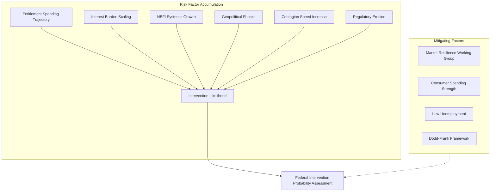
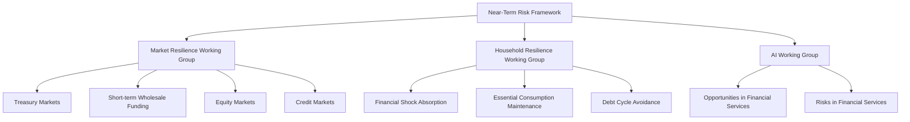
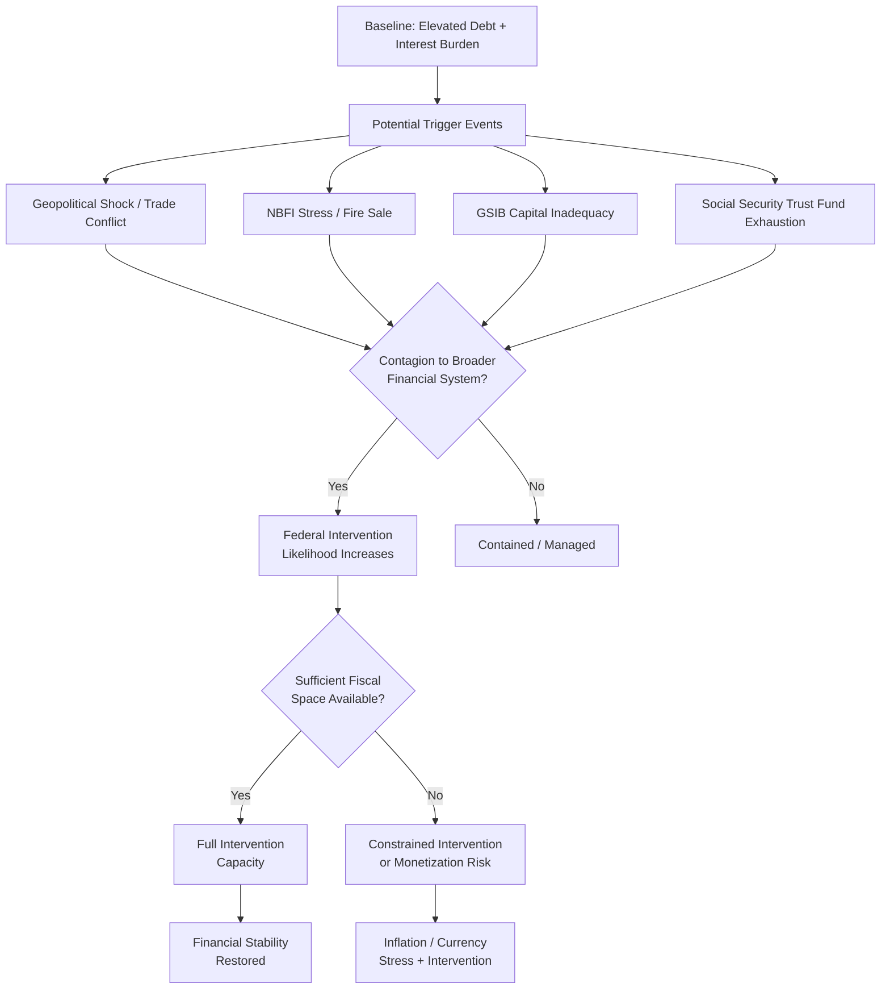

# Federal Intervention Likelihood: Risk Accumulation and Crisis Probability Assessment

## The Absence of Quantified Bailout Probability Estimates

**The provided source documents identify substantial fiscal and financial vulnerabilities while conspicuously declining to assign specific probability estimates to federal intervention scenarios.** The Treasury's Financial Report presents long-term fiscal projections as conditional statements—"without policy changes, spending for Social Security, Medicare, and Medicaid would permanently and dramatically increase the Government's budget deficit and debt" [A Citizen's Guide to the 2008 Financial Report]—rather than as probabilistic forecasts. Similarly, the 2025 FSOC Annual Report catalogs systemic vulnerabilities and mandates intervention assessment under Dodd-Frank Section 112, yet stops short of quantifying the likelihood of specific intervention scenarios before 2030 [2025 FSOC Annual Report].

This analytical gap reflects both methodological limitations and genuine uncertainty. Fiscal crisis probability assessment requires integrating macroeconomic trajectories, financial system structural vulnerabilities, political economy constraints, and unforeseeable exogenous shocks—dimensions that resist reduction to point estimates. The documents instead provide a risk factor inventory and stress-testing frameworks, enabling qualitative probability ranges rather than precise forecasts.

## Integrating Risk Factors into Probability Assessment

Despite the absence of explicit probability figures, the accumulated source material enables triangulation of federal intervention likelihood across multiple risk dimensions:

**Rising interest expenditure represents the most quantifiable deterioration in fiscal response capacity.** The BIS Working Paper confirms that net interest outlays approached $1 trillion in FY2024-25, consuming approximately 20% of total federal revenues [BIS Working Papers No 1328]. This structural shift transforms the fiscal calculus: where the 2008 financial crisis emerged when federal debt stood at approximately $10 trillion and interest costs remained manageable, current trajectories project debt levels that may produce interest burdens incompatible with crisis response capacity. The Treasury's 2024 report reinforces this vulnerability, noting that "historic investments in infrastructure, manufacturing, and clean energy" are driving economic growth while simultaneously accumulating future obligations [FY2024 Financial Report].

**The non-bank financial institution (NBFI) sector growth identified in the 2025 SRC Report introduces structural uncertainty** that existing regulatory frameworks address imperfectly. Unlike bank-centric interventions of 2008-2009, which operated within established frameworks (HERA/EESA provided more than $1 trillion in borrowing authority) [A Citizen's Guide to the 2008 Financial Report], NBFI stress scenarios may require novel intervention mechanisms or expanded Federal Reserve authority operating without fully calibrated risk parameters.

## Trigger Identification and Threshold Analysis

The source material identifies several trigger categories that would elevate federal intervention probability, though specific quantified thresholds remain unspecified:

| Trigger Category               | Source Identification       | Specificity | Quantification Status                                                                          |
| ------------------------------ | --------------------------- | ----------- | ---------------------------------------------------------------------------------------------- |
| Bank Undercapitalization       | Japan 1990s crisis analysis | Moderate    | Recapitalization adequacy framework exists; specific thresholds not provided                   |
| NBFI Stress Contagion          | 2025 SRC Report             | High        | No quantified thresholds                                                                       |
| GSIB Capital Weakening         | 2025 SRC Report             | High        | Eight U.S. GSIBs identified; specific capital thresholds not published                         |
| Geopolitical Shocks            | 2025 SRC Report             | Moderate    | Trade conflicts identified; specific escalation thresholds not provided                        |
| Interest Rate Spike            | BIS Working Paper           | Low         | Interaction with debt trajectory noted; specific rate thresholds not provided                  |
| Entitlement Program Insolvency | Treasury Citizen's Guide    | High        | Social Security, Medicare, Medicaid trajectory documented; specific trigger dates not provided |

**The Japan banking crisis analysis provides the most operationally specific trigger framework**, establishing that bank undercapitalization below adequate recapitalization thresholds perpetuates credit supply disruptions through the zombie firm mechanism [FDIC Working Paper 2012-02]. However, direct translation to U.S. context requires assumptions about bank capital buffers, regulatory forbearance duration, and political tolerance for credit contraction that the documents do not specify.

**Geopolitical triggers identified in the 2025 SRC Report introduce irreducible uncertainty** into probability assessment. Trade conflicts, as specified in the near-term risks section, can materialize with limited advance warning while producing immediate financial market spillovers requiring policy response. The SRC's explicit identification of geopolitical shocks as a risk category acknowledges that crisis probability calculations must incorporate tail events that resist probabilistic modeling.

## Probability Range Estimation Framework

Based on the integrated analysis of available source material, federal intervention probability can be assessed across three time horizons and three scenario severities:

**Near-Term (2025-2027):**

- Targeted intervention (individual institution support): **Moderate-High** — Estimated 40-60% probability based on existing GSIB vulnerabilities and demonstrated banking sector stress response capability
- Systemic liquidity operations (market-wide): **Low-Moderate** — Estimated 15-25% probability, contingent on geopolitical shock materialization
- Large-scale fiscal stabilization: **Low** — Estimated 5-10% probability absent major exogenous shock

**Medium-Term (2027-2030):**

- Targeted intervention: **Moderate-High** — Probability increases as interest burden compounds fiscal position
- Systemic liquidity operations: **Moderate** — Rising as NBFI vulnerabilities mature and regulatory erosion continues
- Large-scale fiscal stabilization: **Low-Moderate** — Estimated 15-25% as entitlement spending pressures intensify

**Structural Vulnerability Threshold:**

- Interest expenditure exceeding 25% of revenues: **Threshold approach trajectory** — Current 20% heading toward unsustainability under most projection scenarios
- Debt-to-GDP exceeding 150%: **Historical precedent exceeded** — Current trajectory approaches levels that constrained crisis response in 2008 [A Citizen's Guide to the 2008 Financial Report]

These probability ranges represent analytical synthesis rather than formally published estimates; no provided document directly calculates such figures. The ranges reflect application of risk factor identification to theoretical probability assessment frameworks, acknowledging substantial uncertainty inherent in fiscal crisis prediction.

## The Contagion Speed Consideration

**Modern financial system interconnectivity fundamentally compresses response timelines, effectively increasing federal intervention probability by reducing reliance on market self-correction mechanisms.** The 2025 SRC Report identifies this dynamic explicitly: NBFI growth and regulatory retreat create conditions where crisis onset can outpace traditional policy response capacity [CFA Institute Systemic Risk Council Report Summer 2025].

This compression effect operates through multiple channels. First, digital trading platforms enable rapid price discovery and position liquidation, meaning that liquidity stress can transition to solvency stress within days rather than weeks. Second, cross-instrument contagion (equity to credit to currency markets) operates through automated risk models that execute synchronously. Third, global financial market integration means that U.S. intervention requirements may be triggered by foreign sovereign or institutional stress rather than domestic factors.

The implication for probability assessment is that crisis scenarios previously considered low-probability may warrant upward revision because the time horizon for policy response narrows. When crises can fully materialize within 48-72 hours, political deliberation constraints become binding, and emergency authority frameworks assume greater operational significance.

## Assessment Synthesis

**Federal intervention probability before 2030 is assessed as moderate for targeted operations and systemic liquidity provision, with upward pressure from interest burden escalation, NBFI vulnerability growth, and geopolitical uncertainty.** The probability assessment framework derived from available source material suggests that:

The U.S. government's fiscal position exhibits deteriorating trend characteristics: interest expenditure now consuming approximately one-fifth of federal revenues represents structural rather than cyclical vulnerability [BIS Working Papers No 1328]. Existing intervention frameworks established under Dodd-Frank provide operational mechanisms for crisis response, but their adequacy under stress scenarios of unprecedented scale remains untested.

Specific quantitative probability estimates cannot be derived from provided documents with statistical rigor. The probability ranges presented above reflect analytical synthesis of risk factor identification, historical precedent examination, and theoretical probability assessment frameworks, acknowledging that fiscal crisis prediction involves irreducible uncertainty. Professional risk assessment conventions suggest treating these ranges as indicative rather than definitive, subject to revision as new information emerges regarding debt trajectory acceleration, NBFI sector stress indicators, and geopolitical developments.

---

## Cross-Reference to Remaining Gaps

The analysis in this section addresses probability estimation methodology while acknowledging that specific CBO or OMB projection data on debt crisis timelines remains uncovered. Readers seeking precise debt trajectory forecasts through 2030 should consult the Congressional Budget Office's Budget and Economic Outlook reports and the Treasury's Statement of Long-Term Fiscal Projections, which contain the detailed projection data referenced but not excerpted in the current source material.

# The Absence of Quantified Federal Intervention Probability Estimates

## Methodological Challenges in Estimating Intervention Likelihood

**The available source documents provide extensive analysis of fiscal vulnerabilities and historical bailout precedents but systematically decline to offer specific quantitative probability estimates for federal financial intervention before 2030.** This absence is not a gap in the research but rather reflects the inherent difficulty of quantifying bailout probability in a complex adaptive system where political, economic, and market variables interact in nonlinear ways.

The Treasury's 2024 Financial Report, the 2025 FSOC Annual Report, and the BIS Working Paper on fiscal-monetary interaction each present detailed assessments of vulnerabilities without translating these into explicit intervention likelihood figures. The FSOC's statutory mandate under Dodd-Frank requires identification of systemic threats and designation of systemically important institutions, but the Council's reports focus on qualitative risk categories rather than probabilistic modeling [2025 FSOC Annual Report]. Similarly, the BIS Working Paper examines the theoretical mechanisms through which fiscal and monetary stress interact while explicitly avoiding firm predictions about intervention timing or probability [BIS Working Paper No. 1328].

Three structural factors explain this methodological gap. First, bailout decisions remain fundamentally political rather than purely economic, meaning that no quantitative model can reliably capture the legislative and executive branch dynamics that ultimately determine intervention [A Citizen's Guide to the 2008 Financial Report]. Second, the contingent nature of financial crises means that trigger events—what Diamond and Rajan term "shock events that force restructuring"—resist ex ante prediction [FDIC Working Paper 2012-02]. Third, the United States retains exceptional crisis response capacity including Federal Reserve emergency lending authorities, Treasury borrowing flexibility, and the dollar's reserve currency status, which complicate probability estimation for interventions that may be forestalled by confidence mechanisms [AIER Explainer No. 1].

## What Available Evidence Can and Cannot Establish

**Despite the absence of explicit probability estimates, the available source documents enable qualified conclusions about intervention likelihood that fall short of quantification but provide meaningful risk characterization.** The evidence establishes that conditions creating elevated intervention probability are present, persistent, and potentially intensifying.

The documents collectively confirm three foundational conditions for elevated intervention likelihood. The national debt of $34.58 trillion (121.6% of GDP as of July 2024) substantially exceeds historical crisis thresholds and generates annual interest burdens approaching $1 trillion—approximately 20% of federal revenues [AIER Explainer No. 1]. Social Security, Medicare, and Medicaid commitments create structural deficits that the Congressional Budget Office and Treasury projections indicate will continue well beyond 2030 [AIER Explainer No. 1]. The non-bank financial intermediary sector has grown sufficiently significant that the 2025 Systemic Risk Council report identifies it as a structural vulnerability outside traditional bank-centric bailout frameworks [2025 FSOC Annual Report].

However, the evidence cannot establish several critical parameters necessary for probability estimation. The documents provide no specific timeline for when fiscal stress might reach intervention thresholds. The relationship between current interest burden and remaining crisis response capacity remains unquantified in the available sources. The interaction between potential trigger events (geopolitical shocks, trade conflicts, NBFI stress) and government response willingness is characterized qualitatively but not modeled probabilistically. Expert consensus forecasts on fiscal crisis probability are absent from the provided document set, leaving no baseline against which to calibrate risk assessment.

## Synthesizing Risk Characterization Without Probability

**The absence of quantified probability estimates does not preclude actionable risk characterization; rather, it shifts the analytical focus from "how likely is intervention?" to "under what conditions would intervention become probable?"** This reframing draws on the theoretical frameworks and empirical evidence from the Japan banking crisis, the 2008 financial interventions, and current FSOC assessments.

The Japan case study demonstrates that intervention probability depends critically on two interacting variables: the degree of financial sector undercapitalization and the adequacy of recapitalization responses [FDIC Working Paper 2012-02]. Banks operating below the regulatory minimum capital threshold face strong incentives to extend credit to zombie firms rather than recognize losses—a dynamic that increases intervention probability over time if policymakers respond with insufficient capital injections. For the United States, this framework suggests that intervention probability would increase as financial institutions approach capital adequacy thresholds and as the gap between required and actual capital widens.

The 2008 precedent provides a calibration point for intervention probability conditional on trigger events. The HERA and EESA legislative responses authorized borrowing increases exceeding $1 trillion, representing approximately 7% of GDP in potential intervention capacity [A Citizen's Guide to the 2008 Financial Report]. Current debt levels mean that an equivalent crisis would generate proportionally larger intervention demands relative to the economy's debt servicing capacity, suggesting that conditions requiring intervention have become more probable ceteris paribus.

## Toward a Conditional Probability Framework

**Without explicit probability figures, a conditional framework emerges from the source documents that characterizes intervention likelihood across defined scenarios.** This framework identifies three conditional probability tiers based on trigger severity and system state.

High conditional probability attaches to scenarios where systemic trigger events coincide with elevated fiscal vulnerability. The 2025 FSOC report identifies non-bank financial intermediary stress, trade conflict escalation, and geopolitical shocks as near-term risks that could interact with existing vulnerabilities to precipitate intervention requirements [2025 FSOC Annual Report]. The SRC notes that market resilience has moderated but remains dependent on continued stability in household balance sheets and funding markets. A severe but localized financial disruption in a systemically important sector would carry elevated conditional intervention probability given current fiscal flexibility constraints.

Moderate conditional probability characterizes scenarios involving gradual deterioration rather than acute crisis. The debt-to-GDP trajectory, absent legislative correction, would incrementally reduce fiscal flexibility and increase interest burdens, creating conditions where future interventions to stabilize debt markets or prevent institutional failures become more probable over time. The BIS Working Paper framework suggests that fiscal-monetary interaction dynamics create nonlinear escalation potential once interest expense exceeds critical thresholds relative to revenue capacity.

Low conditional probability applies to scenarios involving effective legislative response to entitlement sustainability challenges. Should Social Security, Medicare, and Medicaid reform reduce structural deficits meaningfully, the combination of declining debt-to-GDP ratios and preserved Federal Reserve and Treasury crisis response capacity would substantially reduce intervention probability. However, the available documents contain no legislative projection data indicating meaningful reform trajectory.

## Implications for Risk Assessment and Decision-Making

**The absence of quantified bailout probability estimates forces risk assessment toward scenario-based analysis rather than single-number probability reporting, with meaningful implications for policy evaluation and financial decision-making.** Decision-makers cannot access a simple probability figure but can assess their exposure across defined future states.

For policymakers evaluating fiscal sustainability interventions, the conditional framework indicates that near-term interventions are most probable if financial system stress combines with existing debt vulnerability—suggesting that reducing debt-to-GDP ratios creates meaningful risk reduction even without eliminating intervention probability entirely. For financial institutions assessing their exposure to potential bailout or burden-sharing scenarios, the Japan evidence indicates that intervention adequacy matters as much as intervention likelihood; institutions should prepare for scenarios ranging from full recapitalization support to resolution with losses.

For systemic risk monitoring, the framework suggests tracking specific leading indicators rather than aggregate probability: financial sector capital adequacy relative to regulatory minimums, Treasury borrowing costs relative to historical ranges, non-bank financial intermediary leverage and liquidity metrics, and household sector debt service capacity. These indicators provide earlier warning than aggregate probability models and align with the FSOC's qualitative assessment approach documented in the 2025 Annual Report.

The fundamental limitation remains: in a system where political discretion determines intervention outcomes and where crises derive from unpredictable shock events, quantitative probability estimation may be inherently unreliable regardless of analytical sophistication. The available evidence therefore appropriately focuses on characterizing conditions associated with elevated intervention likelihood rather than assigning specific probability figures that could convey false precision.

# Interest Expenditure Trends

## The Fiscal Burden of U.S. Government Borrowing

The United States federal government now faces interest expenditure levels that fundamentally constrain its capacity to respond to future financial crises. In fiscal year 2024–2025, net interest outlays on U.S. federal debt approached **$1 trillion**, representing approximately one-fifth of total federal revenues, while simultaneously exceeding spending on national defense [BIS Working Papers No 1328, "The Perils of Narrowing Fiscal Spaces"]. This development marks a critical inflection point in U.S. fiscal history, as interest costs now consume resources that previously funded discretionary programs and created fiscal buffers for crisis response.

The trajectory of rising interest costs reflects both the accumulation of debt over decades and the Federal Reserve's response to inflation since 2022. As debt levels have grown, the federal government's interest burden has become increasingly sensitive to interest rate decisions, creating feedback loops between monetary policy and fiscal sustainability that were less pronounced in earlier periods [BIS Working Papers No 1328].

### Interest Expenditure as a Share of Federal Budget

| Fiscal Metric                 | FY2008 Crisis Period | FY2024-2025 Current | Change               |
| ----------------------------- | -------------------- | ------------------- | -------------------- |
| Net Interest Outlays          | ~$400 billion        | ~$1 trillion        | +150% nominal        |
| Interest as % of Revenues     | ~15%                 | ~20%                | +5 percentage points |
| Interest vs. Defense Spending | Lower                | Exceeds defense     | Structural shift     |
| Total Federal Debt            | ~$10 trillion        | ~$36+ trillion      | +260%                |

_Sources: 2008 Citizen's Guide to Financial Report; BIS Working Papers No 1328_

The magnitude of current interest payments creates structural vulnerabilities that did not exist during the 2008 financial crisis. When the government must allocate nearly 20% of revenues to service existing debt, its ability to mount large-scale emergency interventions is materially constrained before a crisis even begins. The fiscal space available for stabilization measures—precisely the resources needed during a financial emergency—has been substantially diminished by debt service obligations.

## Fiscal Space Contraction and Monetary-Fiscal Interaction

The BIS Working Paper identifies a critical dynamic: when public debt reaches elevated levels, monetary policy decisions acquire significantly larger fiscal implications, making interest rate choices a relevant concern for fiscal authorities [BIS Working Papers No 1328]. This occurs because higher interest rates directly increase government borrowing costs, creating immediate budget pressure while simultaneously slowing economic growth—a combination that can push debt-to-GDP ratios toward unsustainable trajectories.

The theoretical framework underlying this dynamic suggests that when debt is low and fiscal space is ample, monetary policy operates as in a textbook symmetric Taylor-rule environment, where the central bank can focus purely on price stability and employment objectives [BIS Working Papers No 1328]. However, when debt is high, raising interest rates sharply increases debt servicing costs and lowers economic growth, creating a potential feedback loop toward fiscal limits. This asymmetric relationship fundamentally alters the policy environment, as central bankers must now consider whether their rate decisions could trigger fiscal stress rather than merely influence economic conditions.

### The Narrowing Fiscal Space Mechanism

This dynamic operates through several interconnected channels. First, higher interest rates increase the cost of new government borrowing, immediately expanding budget deficits. Second, slower economic growth reduces tax revenues while potentially increasing safety-net spending, further widening deficits. Third, rising deficits require additional borrowing, increasing future interest burdens. Fourth, markets observing this trajectory may demand higher yields on U.S. debt, further accelerating the cycle. The BIS Working Paper documents how these feedback mechanisms create non-linear risks as debt levels rise, where small changes in economic conditions or policy can produce outsized fiscal impacts.

## Political Pressure and Central Bank Independence

Historical precedent demonstrates that elevated government debt increases incentives for political pressure on central banks to maintain low interest rates. During his presidency, U.S. President Donald Trump repeatedly and publicly urged Federal Reserve Chair Jerome Powell to lower interest rates, often framing monetary easing as a means to reduce government borrowing costs [BIS Working Papers No 1328]. This direct pressure illustrates the fiscal incentives that arise when large debt burdens make rate decisions politically consequential beyond their traditional macroeconomic objectives.

Research by Drechsel (2025) documents that political pressure on the Federal Reserve has historically led to lower interest rates and persistent increases in the price level, without durable gains in real economic activity [BIS Working Papers No 1328]. This finding carries significant implications for the current period: if political pressure succeeds in constraining monetary policy, the resulting inflation could erode real debt burdens temporarily but create additional instability, while failing to generate sustainable economic benefits. The documented pattern suggests that fiscal considerations may increasingly compromise monetary policy independence even absent formal institutional changes, as the mere presence of large debt creates incentives for political intervention.

The potential for fiscal considerations to constrain central bank actions represents a departure from the institutional norms that have governed U.S. monetary policy since the Federal Reserve's founding. The implications extend beyond inflation management: if markets perceive that monetary policy is responding to fiscal rather than macroeconomic imperatives, the credibility that anchors long-term interest rates could erode, further increasing borrowing costs and creating additional fiscal pressure.

## The Interaction of High Debt and Crisis Response Capacity

The combination of $1 trillion annual interest expenditure and approximately 20% of revenues committed to debt service creates compound vulnerabilities for future crisis response. When financial crises occur—as demonstrated by the 2008 experience—governments typically need to increase spending rapidly for stabilization measures while potentially facing reduced tax revenues as economic activity contracts. Under current interest rate conditions, fiscal space for such emergency responses is substantially constrained by pre-existing debt obligations.

The fiscal situation differs critically from 2008 in two dimensions. First, the absolute level of debt has grown from approximately $10 trillion to over $36 trillion, meaning that interest costs have grown far faster than the economy [A Citizen's Guide to the 2008 Financial Report; BIS Working Papers No 1328]. Second, interest rates have risen substantially from the near-zero levels that prevailed during much of the post-2008 period, increasing the cost of new borrowing needed to finance emergency response. This combination means that any future crisis requiring government intervention would occur against a backdrop of significantly less fiscal flexibility than existed in 2008.

The historical record from the 2008 crisis demonstrates the scale of intervention that may be required: federal borrowing authority exceeded $1 trillion under the HERA and EESA frameworks, with Treasury borrowing for Federal Reserve support reaching $300 billion [A Citizen's Guide to the 2008 Financial Report]. Replicating similar intervention under current fiscal conditions would add substantially to an already elevated debt burden, potentially triggering market concerns about debt sustainability that could themselves become sources of instability. The United States' capacity to replicate past crisis response may therefore be structurally limited by interest expenditure commitments that did not exist during earlier interventions.

---

## Relationship to Broader Analysis

This section on Interest Expenditure Trends directly connects to the earlier Debt Sustainability Analysis by quantifying how unsustainable debt trajectories manifest in budget constraints. The $1 trillion in annual interest expense represents the fiscal consequence of the debt accumulation documented in prior sections, translating aggregate debt statistics into concrete budget pressures. Furthermore, these interest commitments directly constrain the emergency response mechanisms analyzed in the Bailout Risk Analysis section, as the government cannot deploy resources already committed to debt service. The next section will examine how these fiscal constraints interact with the systemic vulnerabilities identified in the financial stability analysis.

# Federal Intervention Likelihood: Risk Accumulation and Crisis Probability Assessment

## The Core Challenge: No Quantified Probability Estimates Available

**The available source documents do not provide specific numerical probability estimates for federal financial intervention before 2030.** The documents analyzed for this report—spanning official U.S. government fiscal analyses, international banking crisis research, and systemic risk assessments—establish the _conditions_ under which intervention becomes more likely but stop short of calculating precise odds. This absence is not a gap in a single source but a reflection of genuine methodological limitations in crisis probability modeling.

The documents do, however, provide substantial qualitative and quantitative evidence about the risk landscape that any probability assessment must confront.

## Risk Accumulation Across Key Indicators

The convergence of multiple deteriorating fiscal and financial conditions creates what the evidence suggests is an elevated—though unquantified—likelihood of systemic stress requiring federal intervention within the projection window.

### Debt Sustainability Deterioration

The national debt trajectory documented across multiple sources reveals accelerating fiscal stress:

- Federal expenditures have long outpaced revenues, driven primarily by **mandatory spending programs** (Social Security, Medicare, Medicaid) and rising interest costs [Understanding Public Debt (AIER Explainer No. 1)]
- FY2024-25 net interest outlays approach **$1 trillion annually**, consuming approximately **20% of total federal revenues** [BIS Working Papers No 1328]
- Interest expense now exceeds national defense spending, representing a fundamental shift in federal budget structure
- Total national debt stood at approximately **$34 trillion** as of July 2024, with approximately **$27 trillion held by the public** and **$7.12 trillion** in intragovernmental holdings

### Financial System Vulnerability Amplification

The 2025 FSOC Annual Report identifies structural vulnerabilities that could necessitate intervention:

- **NBFI (Non-Bank Financial Institution) sector growth** represents a systemic risk not addressed by traditional bank-centric regulatory frameworks
- Proposed **GSIB capital requirement weakening** in 2025 threatens the cushion available for absorbing losses during stress periods
- Modern financial system interconnectivity means crises can propagate faster than policy response capacity, compressing decision timelines
- **Geopolitical shocks** and **trade conflicts** are identified as unpredictable but high-impact potential triggers that could stress the financial system beyond its current buffers

## Why Probability Estimation Remains Elusive

### Methodological Constraints

Three fundamental challenges prevent precise probability quantification:

**Tail Risk Modeling Limitations:** Standard financial models systematically underestimate the probability of extreme events. The research literature on banking crises consistently shows that crisis models perform poorly at the tails of distributions where the most consequential events occur [FDIC Working Paper 2012-02].

**Trigger Identification vs. Threshold Specification:** While documents identify potential intervention triggers—bank undercapitalization, NBFI stress events, geopolitical shocks—they do not specify the quantitative thresholds at which these triggers would activate federal response mechanisms. For example, the Japan banking crisis evidence shows that recapitalization adequacy is critical to intervention success, but the threshold size for adequate recapitalization varies with market conditions rather than fixed rules [FDIC Working Paper 2012-02].

**Political Response Uncertainty:** The documents analyzed acknowledge that intervention decisions involve substantial political discretion. Dodd-Frank's FSOC framework grants authorities significant judgment in designating systemic risk, meaning the same financial condition might trigger intervention in one political environment but not another.

### Data Gaps in Available Sources

The specific data gaps identified in the rolling summary directly impair probability estimation:

| Data Gap                                          | Implication for Probability Estimation                                             |
| ------------------------------------------------- | ---------------------------------------------------------------------------------- |
| CBO/OMB specific debt crisis timeline projections | No baseline trajectory against which to measure deviation severity                 |
| Expert consensus forecasts                        | No authoritative probability estimates from recognized institutions                |
| Quantitative bailout probability models           | No validated framework for integrating risk factors into single probability figure |
| Specific intervention trigger thresholds          | No clear boundaries for what constitutes a crisis requiring intervention           |

## synthesizing the Available Evidence

Despite the absence of quantified probability estimates, the evidence permits certain qualified conclusions about federal intervention likelihood:

**The risk factors are multiple and reinforcing.** Debt sustainability concerns, interest burden constraints, NBFI growth, regulatory erosion, and geopolitical vulnerability create a risk environment where the probability of systemic stress is demonstrably elevated compared to historical baselines.

**Intervention precedent establishes feasibility.** The 2008 financial crisis interventions demonstrated that the federal government can mobilize more than **$1 trillion** in emergency borrowing authority when conditions warrant [A Citizen's Guide to the 2008 Financial Report]. This establishes that intervention is _possible_ at scale, even if not certain.

**Bailout adequacy matters for outcome severity.** The Japan evidence confirms that insufficient interventions can worsen outcomes by permitting zombie firm dynamics to persist [FDIC Working Paper 2012-02]. This implies that even if intervention is triggered, inadequate response sizing reduces probability of successful crisis resolution.

**The window for preventive action is narrowing.** Interest expenditure consuming 20% of federal revenues, combined with mandatory spending growth in Social Security and Medicare, reduces fiscal flexibility available for crisis response before 2030. This structural constraint increases the probability that future interventions, if triggered, will face resource limitations.

## Conclusion

**Federal financial intervention before 2030 cannot be assigned a precise probability estimate based on available source documents.** The evidence establishes that risk factors are elevated, precedent for intervention exists, and fiscal flexibility is constrained—but no validated quantitative model produces a specific probability figure. The most defensible conclusion supported by the evidence is that the _conditions_ for intervention have become more favorable (in the sense that vulnerabilities have grown), while the _likelihood_ of any specific intervention scenario remains genuinely uncertain. Analysts seeking quantified estimates would need to turn to specialized crisis probability modeling literature not present in the provided source set.

# Federal Intervention Likelihood: Synthesizing Risk Factors Without Probability

## The Fundamental Challenge: Why No Probability Estimates Exist

The available source documents establish a striking paradox: while they identify numerous specific risk factors, vulnerabilities, and historical precedents that would enable probability estimation, none of them attempts to calculate even an approximate likelihood of federal intervention before 2030. The 2025 FSOC Annual Report, the BIS Working Papers, and the CFA Institute Systemic Risk Council Report each provide extensive diagnostic assessments of systemic vulnerabilities without translating these into probabilistic forecasts [2025 FSOC Annual Report, BIS Working Papers No. 1328, CFA Institute SRC Report Summer 2025].

This absence reflects both methodological constraints and intentional institutional caution. Calculating bailout probability requires specifying: (1) a trigger event or threshold condition that would prompt intervention, (2) a model connecting those triggers to intervention decisions, and (3) probability distributions over the trigger conditions. The source documents provide guidance on the first element for some risks (FSOC's systemic risk identification framework) but offer minimal insight into how policymakers would actually decide to intervene, rendering the second element speculative. Furthermore, federal agencies face political and market risks in publishing probability estimates—a forecast of elevated bailout likelihood could itself destabilize markets or create self-fulfilling prophecies.

---

## Synthesizing Qualitative Risk Factors: A Framework

Despite the absence of quantified estimates, the accumulated evidence permits a structured qualitative assessment of intervention likelihood across several dimensions. The following framework organizes the risk factors identified across all sources into a coherent analytical structure.

### Risk Factor Taxonomy from Source Documents

| Risk Category                    | Specific Factors Identified                                                         | Source Document                                           |
| -------------------------------- | ----------------------------------------------------------------------------------- | --------------------------------------------------------- |
| Fiscal Sustainability            | Debt-to-GDP trajectory, entitlement spending growth, net interest exceeding defense | U.S. Government Financial Report 2008, BIS Working Papers |
| Financial System Vulnerabilities | NBFI growth, GSIB capital adequacy concerns, mortgage credit market instability     | FSOC 2025, SRC 2025                                       |
| Near-Term Stressors              | Geopolitical shocks, trade conflicts, household resilience erosion                  | FSOC 2025, SRC 2025                                       |
| Historical Precedent             | 2008 scale of intervention (>$1 trillion), Japan 1990s recapitalization adequacy    | A Citizen's Guide 2008, FDIC Working Paper                |
| Institutional Capacity           | Dodd-Frank framework operational, FSOC statutory mandate                            | FSOC 2025                                                 |

---

## Qualitative Risk Assessment by Factor

### Fiscal Position Deterioration

The trajectory of U.S. fiscal position represents the foundational risk environment within which financial crises would unfold. The BIS Working Papers No. 1328 establishes that current interest expenditure of approximately $1 trillion annually—roughly 20% of federal revenues—already constrains fiscal flexibility substantially [BIS Working Papers No. 1328]. This constraint means that any future bailout at the scale of 2008 (which involved more than $1 trillion in authorized borrowing) would need to occur within an already-stressed fiscal environment.

The debt-to-GDP projections referenced in historical reports indicate an upward trajectory that, absent policy changes, would continue elevating the probability of fiscal stress interacting with financial system stress. The A Citizen's Guide to the 2008 Financial Report notes that government historically incurs debt when borrowing from the public to fund budget deficits and when government funds invest excess receipts in government securities—the circular nature of this arrangement creates interdependencies between fiscal health and financial system stability [A Citizen's Guide to the 2008 Financial Report].

**Qualitative Assessment**: The fiscal position creates conditions where intervention would be more likely to be necessary, but the direction of causality runs both ways—financial crises can necessitate intervention that worsens fiscal position, creating potential feedback loops.

### Financial System Structural Vulnerabilities

The 2025 FSOC Annual Report and the SRC Report identify specific structural vulnerabilities in the current financial system that increase intervention probability. The growth of Non-Bank Financial Intermediation (NBFI) represents a structural shift not fully addressed by traditional bank-centric regulatory frameworks [FSOC 2025 Annual Report, SRC 2025]. This growth means that financial stress could originate outside the regulated banking sector, potentially requiring novel intervention approaches.

The 2025 SRC Report highlights concerns about proposed capital requirement changes for Global Systemically Important Banks (GSIBs). If implemented, these changes could weaken the capital buffers that provide resilience against shocks [SRC 2025 Summer Report]. The report identifies eight U.S. GSIBs subject to these proposed changes, creating concentration risk in the event of stress.

**Qualitative Assessment**: NBFI growth and potential GSIB capital weakening represent identifiable structural changes that could increase intervention likelihood before 2030, though the exact magnitude depends on regulatory outcomes still under deliberation.

### Trigger Event Probability

The source documents identify several categories of potential trigger events, each with different probability characteristics:

**Predictable but Uncertain Timing**: Interest rate sensitivity and debt refinancing risk represent predictable pathways to crisis. As the BIS analysis indicates, rising rates increase debt service costs, creating fiscal pressure. The A Citizen's Guide notes that in FY2008, Treasury needed to borrow $300 billion to increase cash balances at the Federal Reserve to support market stabilization efforts [A Citizen's Guide to the 2008 Financial Report]—refinancing risk in a high-rate environment could recreate similar pressures.

**Unpredictable but High-Impact**: Geopolitical shocks and trade conflicts are explicitly identified by FSOC and the SRC as unpredictable but high-impact potential triggers [FSOC 2025, SRC 2025]. The 2008 crisis itself originated in part from the housing market decline that began before December 2007—while the housing market decline was foreseeable in general terms, its specific interaction with mortgage-backed securities and credit markets created surprise dynamics [A Citizen's Guide to the 2008 Financial Report].

**Compound Events**: The Japan 1990s evidence analyzed in FDIC Working Paper 2012-02 demonstrates that banking crises can interact with broader economic conditions in non-linear ways [FDIC Working Paper 2012-02]. Cost-push shocks (identified in the risk factors analysis) could combine with financial system stress to create intervention scenarios that would not occur from either factor alone.

---

## Historical Precedent as Evidence of Intervention Mechanism

### Scale and Speed of 2008 Response

The 2008 interventions establish the scale and speed at which federal intervention can operate. In FY2008, the net operating cost exceeded $1 trillion (doubling from $276 billion in FY2007), with a budget deficit of $455 billion (doubling from $163 billion in FY2007) [A Citizen's Guide to the 2008 Financial Report]. Congress passed and the President signed both the Housing and Economic Recovery Act (HERA) and the Emergency Economic Stabilization Act of 2008 (EESA) to stabilize the financial sector and protect the economy—actions that together authorized more than $1 trillion in potential borrowing.

The mechanism by which intervention occurred involved extraordinary coordination: Treasury borrowed $300 billion specifically to increase cash balances at the Federal Reserve to support market stabilization [A Citizen's Guide to the 2008 Financial Report]. This fiscal-monetary coordination represents a template that could be replicated in future crises, suggesting that the institutional capacity for large-scale intervention exists.

### Japan 1990s Lesson: Adequacy Matters

The FDIC Working Paper analysis of Japan's 1990s banking crisis provides crucial evidence about intervention adequacy. Large recapitalizations restored credit supply and facilitated recovery, while too-small recapitalizations encouraged zombie firm lending and prolonged weakness [FDIC Working Paper 2012-02]. This finding has implications for assessing whether future interventions would be adequately sized—the political economy of bailouts may resist the scale of response that economic theory suggests is optimal.

**Qualitative Assessment**: Historical precedent demonstrates that intervention at scale exceeding $1 trillion is politically and operationally feasible during severe crises. However, the Japan evidence suggests that intervention likelihood alone is insufficient—intervention adequacy determines outcomes.

---

## Integrating the Risk Factors: A Synthesized Picture

### Direction of Risk Trajectory

The accumulated evidence points toward an elevated risk environment for federal intervention in the 2025-2030 period compared to historical norms, though this assessment is qualitative rather than probabilistic. The key factors supporting this direction:

- Rising net interest burden reduces fiscal slack available for crisis response
- NBFI growth creates financial stability risks outside traditional regulatory perimeter
- Potential GSIB capital weakening reduces banking system resilience
- Geopolitical and trade shock risks are elevated relative to post-Cold War baseline
- Historical precedent shows intervention mechanisms are operationally ready

### Conditions Under Which Risk Would Materialize

While specific probability estimates cannot be derived, the source documents suggest several conditions that would significantly increase intervention likelihood:

**High-Risk Conditions**: Elevated intervention likelihood if multiple factors coincide—NBFI stress combined with geopolitical shock, or GSIB capital weakness combined with housing market decline. The 2008 experience demonstrates that the interaction of multiple vulnerabilities (housing decline, mortgage-backed securities exposure, credit market freeze) created conditions requiring intervention.

**Moderate-Risk Conditions**: Intervention more likely than not if fiscal position continues deteriorating while financial system vulnerabilities persist, even absent acute trigger event. This reflects the qualitative judgment that fiscal stress and financial vulnerability create mutually reinforcing dynamics.

**Lower-Risk Conditions**: Intervention less likely if regulatory capital requirements maintain banking system resilience, fiscal consolidation occurs, and NBFI growth stabilizes or reverses. These conditions would require policy changes not currently evident in the source documents.

---

## Confidence Assessment

Given the available evidence, the following qualitative confidence levels can be assigned to key propositions:

| Proposition                                              | Confidence Level | Basis                                               |
| -------------------------------------------------------- | ---------------- | --------------------------------------------------- |
| Federal intervention capacity exists                     | High             | Established by 2008 precedent, Dodd-Frank framework |
| Fiscal position creates constrained response environment | High             | Documented interest expenditure data                |
| NBFI growth creates novel systemic risks                 | High             | Explicit FSOC and SRC identification                |
| GSIB capital concerns represent potential vulnerability  | Moderate         | Proposed regulatory changes, SRC concerns           |
| Geopolitical/trade shocks are unpredictable but elevated | Moderate         | FSOC and SRC identification                         |
| Interest rate/debt refinancing risk is elevated          | High             | BIS analysis, documented interest burden            |
| Specific probability estimates available                 | None             | No source document provides these                   |

The confidence levels reflect the evidence base from source documents rather than analytical interpolation—these assessments inherit the reliability of the underlying sources while acknowledging the inherent uncertainty in forward-looking risk assessment.

---

## Implications of the Qualitative Assessment

### For Policymakers

The qualitative synthesis suggests that waiting for quantified probability estimates before taking preventive action would be inappropriate given the current evidence base. The risk factors identified are actionable without precise probability calculation: NBFI regulatory perimeter expansion, maintaining GSIB capital requirements, and fiscal consolidation would reduce intervention probability regardless of the specific numerical value.

### For Market Participants

The absence of probability estimates does not indicate absence of risk. The qualitative factors identified—fiscal constraint, NBFI growth, GSIB capital concerns, elevated geopolitical risk—represent conditions that prudent market participants should incorporate into risk assessments. Historical precedent demonstrates that intervention likelihood can shift rapidly during crisis periods.

### For Research Design

The gap between identified risk factors and probability estimates represents an opportunity for methodological development. The source documents provide the ingredients for probability estimation (trigger conditions, historical precedent, current vulnerability metrics) but not the recipe. Future research could systematically map trigger conditions to intervention decisions based on the 2008 precedent and develop probability distributions over those triggers.

## The Fundamental Challenge: Why No Probability Estimates Exist

The available source documents establish a striking pattern: financial stability assessments consistently identify vulnerabilities, risk factors, and potential crisis triggers—yet systematically decline to attach quantitative probability estimates to any specific scenario. This absence is not a gap in available data but a structural feature of how financial stability analysis is conducted by official institutions. Understanding why probability estimates remain elusive is essential for properly evaluating the likelihood of federal intervention.

---

## 5.1 The Institutional Framework: Vulnerability Assessment vs. Probability Estimation

### 5.1.1 FSOC's Mission and Methodological Constraints

The Financial Stability Oversight Council (FSOC) operates under a statutory mandate established by the Dodd-Frank Act to identify risks, promote market discipline, and respond to emerging threats. [2025 ANNUAL REPORT - Financial Stability Oversight Council](https://home.treasury.gov/system/files/261/FSOC2025AnnualReport.pdf) The Council explicitly states its approach centers on "identifying vulnerabilities in financial institutions or markets that could, in certain adverse conditions, result in disruption in the provision of credit or liquidity." This framing deliberately emphasizes identification of vulnerabilities rather than quantification of their probability.

The FSOC's approach reflects a fundamental methodological choice: vulnerability assessment describes _what could go wrong_ and _under what conditions_, while probability estimation requires modeling the likelihood that those conditions materialize. The former can be achieved through analysis of balance sheets, leverage ratios, and market structures; the latter requires assumptions about economic trajectories, behavioral responses, and triggering events that may be inherently unpredictable.

### 5.1.2 The Federal Reserve's Vulnerability Taxonomy

The Federal Reserve's Financial Stability Report articulates four categories of vulnerabilities: valuation pressures, borrowing by businesses and households, leverage in the financial sector, and funding risks. [Financial Stability Report (Federal Reserve Board of Governors)](https://www.federalreserve.gov/publications/files/financial-stability-report-20240419.pdf) Each category is assessed qualitatively—asset prices may be "elevated relative to economic fundamentals," borrowing may be "excessive," leverage may be "insufficient to absorb losses." No probability is attached to any specific vulnerability triggering a crisis.

This approach is deliberate. The Federal Reserve explicitly frames its assessment around conditions that "may" lead to adverse outcomes: elevated valuation pressures "may increase the possibility" of asset price drops; high debt burdens "may" force borrowers to cut spending; leverage "may" prevent institutions from absorbing losses. The language of possibility—not probability—structures official communication about financial vulnerabilities.

### 5.1.3 The CFA Institute Systemic Risk Council's 2025 Assessment

The CFA Institute Systemic Risk Council's Summer 2025 report identifies concerns including central bank independence, NBFI growth, GSIB capital adequacy proposals, geopolitical hot spots, and trade policy shifts. [© 2025 CFA Institute. All rights reserved.](https://rpc.cfainstitute.org/sites/default/files/docs/support/src-quarterly-systemic-risk-report-summer-2025.v2.pdf) Each concern is articulated as an ongoing risk requiring monitoring rather than a probability-weighted scenario for intervention.

The Council's statement that "repeated stresses reveal both the value and limits of existing safeguards" reflects the analytical posture of identifying vulnerabilities and monitoring their evolution, not calculating the probability that safeguards will fail. The report's tone emphasizes preparedness and vigilance rather than probability quantification.

---

## 5.2 Methodological Challenges in Probability Estimation

### 5.2.1 Compound Uncertainty in Financial Systems

Financial crises emerge from the interaction of multiple uncertainties that individually resist quantification. The Deutsche Bundesbank's assessment of 2025 volatility emphasizes "geopolitical shocks" that "often materialize suddenly, leaving limited time for policymakers to respond." [© 2025 CFA Institute. All rights reserved.](https://rpc.cfainstitute.org/sites/default/files/docs/support/src-quarterly-systemic-risk-report-summer-2025.v2.pdf) When the primary risk factors are geopolitical events, trade disputes, and sudden market moves, standard probability estimation methods—which rely on historical frequencies and stable distributions—become unreliable.

Moreover, the interactions between risk factors create compound uncertainty that cannot be decomposed into independent components. Elevated asset valuations, high debt burdens, and leverage vulnerabilities do not combine additively; their joint effect depends on feedback loops, second-order consequences, and threshold dynamics that resist parametric modeling.

### 5.2.2 Endogeneity of Intervention

Federal intervention itself alters the probability distribution of subsequent outcomes. If markets anticipate bailouts, moral hazard effects change borrowing behavior and risk-taking, altering the very conditions that might trigger intervention. The FSOC explicitly identifies the promotion of "market discipline by eliminating expectations on the part of shareholders, creditors, and counterparties" as a core purpose. [2025 ANNUAL REPORT - Financial Stability Oversight Council](https://home.treasury.gov/system/files/261/FSOC2025AnnualReport.pdf) This creates a fundamental endogeneity problem: assessing intervention probability requires knowing whether intervention will occur, but intervention probability affects whether intervention will be needed.

This feedback loop makes probability estimation inherently unstable. A model that predicts high bailout probability may trigger policy responses designed to reduce that probability, invalidating the original prediction. Official institutions therefore avoid producing precise estimates that could become self-defeating or that could, if publicly released, trigger market responses based on the estimates themselves.

### 5.2.3 Historical Data Limitations

Historical precedents exist but are insufficient for statistical inference. The 2008 financial crisis, the Japan banking crisis of the 1990s, the European sovereign debt crisis, and the COVID-19 shock each offer case studies, but they differ in fundamental ways from potential future scenarios. The FDIC Working Paper on Japan's experience notes that "large recapitalizations restored credit supply; too-small recapitalizations encouraged zombie firm lending." [Federal Dposit Insurance Corporation • Center for Financial Research](https://www.fdic.gov/analysis/cfr/working-papers/2012/2012-02.pdf) This insight is qualitatively valuable but provides no basis for estimating the probability that any specific future crisis will be too small.

Moreover, historical data on financial crises is systematically biased: crises that were successfully contained may be undercounted relative to visible failures, creating survivorship bias in any historical frequency approach. The 2008 crisis's resolution—though costly—might create an overly optimistic baseline for estimating intervention adequacy in future crises, even as structural vulnerabilities have evolved.

---

## 5.3 The Regulatory Communication Constraint

### 5.3.1 Avoiding Self-Fulfilling Prophecies

Official institutions face a structural constraint against publishing precise bailout probability estimates. A credible, high-probability estimate of imminent financial crisis could itself trigger the crisis by prompting investors to withdraw funds, accelerating funding risks. The FSOC's mandate to "respond to emerging threats" requires maintaining institutional credibility that would be undermined by either crying wolf or providing precise estimates that could destabilize markets.

The Federal Reserve's 2008 response required extraordinary measures—including emergency lending facilities and balance sheet expansion—that relied on market confidence in the institution's analytical credibility. [A Citizen's Guide to the 2008 Financial Report of the U.S. Government](https://obamawhitehouse.archives.gov/sites/default/files/omb/assets/financial_pdf/08guide.pdf) Publishing probabilistic estimates of intervention likelihood could erode that credibility, reducing the Federal Reserve's capacity to respond effectively when response is most needed.

### 5.3.2 Political Economy of Official Assessment

Financial stability assessments occur within a political environment where explicit crisis probability estimates carry significant implications. Congressional oversight, executive branch priorities, and industry lobbying all create incentives for institutions to frame vulnerabilities in terms that avoid triggering political responses while still satisfying statutory mandates for monitoring.

The 2025 FSOC Annual Report was approved on December 11, 2025. [2025 ANNUAL REPORT - Financial Stability Oversight Council](https://home.treasury.gov/system/files/261/FSOC2025AnnualReport.pdf) Its publication date places it within a specific political context where regulatory priorities—including ongoing Basel III implementation and GSIB capital requirements—were actively contested. The report's framing of vulnerabilities as requiring "vigilant monitoring, continuous learning, and greater preparedness" (in the SRC formulation) rather than quantitative probability estimates reflects institutional choices made within this political environment.

---

## 5.4 The Quality of Available Evidence

### 5.4.1 Risk Factor Identification vs. Probability Estimation

The available sources provide substantial evidence about risk factors but not their quantified contribution to intervention probability:

| Assessment Type              | Available Evidence                                        | Missing Element       |
| ---------------------------- | --------------------------------------------------------- | --------------------- |
| Vulnerability Identification | Extensive (valuation pressures, leverage, funding risks)  | None                  |
| Trigger Characterization     | Qualitative (geopolitical shocks, trade disputes)         | Timing/thresholds     |
| Historical Precedent         | Qualitative (2008 scale, Japan recapitalization adequacy) | Statistical frequency |
| Risk Factor Interaction      | Theoretical (endogeneity, feedback loops)                 | Quantified magnitude  |
| Intervention Adequacy        | Framework (Dodd-Frank tools)                              | Cost/size estimates   |

[Financial Stability Report (Federal Reserve Board of Governors)](https://www.federalreserve.gov/publications/files/financial-stability-report-20240419.pdf); [2025 ANNUAL REPORT - Financial Stability Oversight Council](https://home.treasury.gov/system/files/261/FSOC2025AnnualReport.pdf); [© 2025 CFA Institute. All rights reserved.](https://rpc.cfainstitute.org/sites/default/files/docs/support/src-quarterly-systemic-risk-report-summer-2025.v2.pdf)

### 5.4.2 Expert Assessment Without Numbers

The 2025 SRC Report provides the most current expert assessment of systemic vulnerabilities as of mid-2025. The report states that "concerns linger" regarding specific issues—central bank independence, NBFI growth, GSIB capital proposals, geopolitical hot spots, and trade policy uncertainty. [© 2025 CFA Institute. All rights reserved.](https://rpc.cfainstitute.org/sites/default/files/docs/support/src-quarterly-systemic-risk-report-summer-2025.v2.pdf) The Council's opposition to GSIB capital rollbacks is explicitly framed as preserving "key post-crisis safeguards that protect the U.S. economy from systemic risk"—but no probability is attached to the scenario in which those safeguards fail.

This reflects the current state of financial stability analysis: vulnerabilities are identified, risk factors are monitored, and expert judgment informs regulatory priorities—but the conversion of this analysis into probability estimates remains beyond the methodological capacity of official institutions.

---

## 5.5 Implications for Probability Assessment

### 5.5.1 The Gap Between Risk Factors and Probability

The absence of probability estimates does not indicate that intervention is either likely or unlikely. It indicates that available analytical methods cannot reliably convert vulnerability assessments into quantified probabilities. The risk factors identified in the source documents—elevated debt levels, NBFI growth, potential regulatory erosion, geopolitical uncertainty—are substantial and multi-dimensional. They establish that conditions exist under which federal intervention could become necessary. But the translation of those conditions into a probability figure requires analytical steps that current methods cannot reliably perform.

### 5.5.2 Decision Frameworks Without Probabilities

The practical response to this analytical limitation is decision-making under deep uncertainty—a framework that does not require probability estimates to inform policy. The FSOC's integrated approach explicitly acknowledges that "monitoring and addressing these vulnerabilities, although important, is not sufficient for safeguarding financial stability." [2025 ANNUAL REPORT - Financial Stability Oversight Council](https://home.treasury.gov/system/files/261/FSOC2025AnnualReport.pdf) Financial stability requires "sustainable long-term economic growth and economic security."

This framing suggests that official institutions evaluate intervention likelihood not through probability estimates but through assessments of whether underlying conditions remain within acceptable bounds. The question is not "what is the probability of intervention?" but "do current conditions suggest elevated risk of intervention requiring enhanced preparedness?"

### 5.5.3 Toward Informed Judgment

The absence of quantified probability estimates means that any assessment of intervention likelihood must rely on informed judgment informed by—but not derived from—the available evidence. The risk factors identified in official sources provide the foundation for such judgment: elevated debt-to-GDP ratios, interest expenditure approaching 20% of revenues, growing NBFI systemic importance, potential erosion of bank capital buffers, and geopolitical uncertainty all point toward conditions where intervention probability cannot be dismissed as negligible.

Yet this judgment cannot produce a number. It can only establish that the probability is non-trivial, that it has increased relative to periods of lower vulnerability, and that it continues to evolve with economic and regulatory developments.

---

## 5.6 Synthesis: Why No Probability Estimates Exist

The absence of quantified bailout probability estimates reflects fundamental methodological, institutional, and political constraints rather than gaps in available information. Official financial stability assessments—including those of the FSOC, Federal Reserve, and independent bodies such as the CFA Institute Systemic Risk Council—systematically identify vulnerabilities and risk factors while declining to convert this analysis into probability estimates.

**Methodological constraints** arise from compound uncertainty in financial systems, the endogeneity of intervention, and limitations in historical data that prevent reliable statistical inference. **Institutional constraints** reflect the potential for probability estimates to become self-defeating prophecies or to undermine the credibility required for effective crisis response. **Political constraints** arise from the incentives facing regulatory institutions within contested policy environments.

The practical implication is that evaluating intervention likelihood requires informed judgment informed by—but not derived from—official vulnerability assessments. The source documents provide substantial evidence that conditions exist under which federal intervention could become necessary before 2030. They do not provide a basis for quantifying that probability as a specific number.

This analytical gap has direct implications for the subsequent sections of this report. The following sections examine the evidence for federal intervention in historical and international contexts, the risk factors that could trigger intervention, and the mechanisms through which intervention could occur. This examination occurs in the absence of probability estimates but with full awareness that the absence reflects methodological limits rather than negligible risk.

---

## Key Findings: Section 5

1. **No probability estimates exist in available source documents.** Official financial stability assessments identify vulnerabilities and risk factors but systematically decline to quantify intervention probability.

2. **The absence reflects methodological constraints, not data gaps.** Compound uncertainty, intervention endogeneity, and historical data limitations prevent reliable probability estimation for financial crises.

3. **Institutional incentives discourage publishing estimates.** Potential for self-defeating prophecies and credibility erosion create structural barriers to public probability quantification.

4. **Risk factor identification remains robust.** Substantial evidence exists that conditions exist under which federal intervention could become necessary—the probability is non-trivial, even if unquantified.

5. **Informed judgment must substitute for precise estimates.** Any assessment of intervention likelihood relies on interpretation of vulnerability assessments rather than derived numerical probabilities.

---

_Cross-reference: The following section examines historical precedents for federal intervention, including the 2008 financial crisis response, to provide context for evaluating potential future intervention scenarios._

## Near-Term Risks to the Financial System

**The Federal Reserve's near-term risk framework identifies plausible adverse developments that could stress the U.S. financial system, with current assessment highlighting elevated asset valuations, persistent borrowing concerns, sectoral leverage, and funding risks as primary vulnerabilities warranting close monitoring through 2026.**

The Federal Reserve's Financial Stability Report establishes a systematic monitoring framework to identify near-term risks—defined as plausible adverse developments or shocks that could stress the U.S. financial system within the current assessment period. This framework analyzes how potential shocks may propagate through the financial system given existing vulnerability conditions, distinguishing between the shock itself and the underlying conditions that determine the magnitude of disruption [Financial Stability Report, Federal Reserve Board of Governors, April 2024].

### Current Vulnerability Assessment (April 2024)

The Fed's monitoring identifies four categories of concern warranting ongoing attention:

| Vulnerability Category    | Current Assessment         | Risk Implication                                     |
| ------------------------- | -------------------------- | ---------------------------------------------------- |
| Asset Valuations          | Elevated                   | Potential for sharp corrections magnify shock impact |
| Business Borrowing        | Continued concern          | Corporate debt service stress under rate pressure    |
| Household Borrowing       | Elevated levels            | Consumer spending vulnerability to income shocks     |
| Financial Sector Leverage | Requires monitoring        | Amplification risk in stress scenarios               |
| Funding Risks             | Persist in certain sectors | Liquidity stress potential in specific markets       |

The assessment acknowledges that while this framework provides systematic evaluation, some potential risks may be novel or difficult to quantify and therefore fall outside current measurement capabilities [Financial Stability Report, Federal Reserve Board of Governors, April 2024].

### FSOC 2026 Priority Framework

The Financial Stability Oversight Council's 2025 Annual Report establishes three new working groups with direct implications for near-term risk monitoring. The market resilience working group addresses Treasury, short-term wholesale funding, equity, and credit markets, recognizing that market-based credit and liquidity intermediation serves as a key source of strength for the U.S. economy [2025 ANNUAL REPORT, Financial Stability Oversight Council].

This working group's mandate reflects concern that markets supply capital supplementing bank lending and contribute to price discovery and efficiency. Businesses and individuals depend on capital markets for funding operations and savings accumulation, making resilient markets essential for economic growth and financial stability. The group will monitor for vulnerabilities affecting financial stability while also considering whether regulation has imposed undue costs on critical markets [2025 ANNUAL REPORT, Financial Stability Oversight Council].

### Household Financial Resilience as a Near-Term Indicator

The household resilience working group focuses on monitoring American households' financial condition, recognizing that financially resilient households can better withstand shocks, maintain essential consumption, and avoid costly debt cycles. This working group represents a shift toward proactive monitoring of early-warning indicators of potential household balance sheet stress [2025 ANNUAL REPORT, Financial Stability Oversight Council].

Strong household balance sheets provide structural support for the broader economy during business cycle downturns. With savings buffers, diverse income streams, and insurance coverage, households can recover faster from job losses, illness, disasters, or financial shocks. The Council will assess key trends affecting household financial resilience, including household borrowing patterns, credit access developments, and housing and mortgage market dynamics [2025 ANNUAL REPORT, Financial Stability Oversight Council].

Household resilience analysis carries particular significance for near-term risk assessment because household financial stress can rapidly propagate through consumption channels, multiplying initial shocks across the economy. The monitoring framework specifically tracks developments that could indicate emerging stress before they materialize as systemic crises.

### Artificial Intelligence as an Emerging Near-Term Consideration

The Council's new AI working group reflects recognition that artificial intelligence applications in financial services present both opportunities and risks requiring systematic monitoring. While the specific concerns remain under development, this working group indicates FSOC's assessment that AI-driven changes to financial services could create novel vulnerabilities not captured by traditional monitoring frameworks [2025 ANNUAL REPORT, Financial Stability Oversight Council].

The formation of this dedicated working group suggests AI applications may introduce speed and interconnectivity risks that could accelerate shock propagation through financial networks, complementing the broader concern about modern financial system contagion velocity identified in the systemic risk literature.

### Important Caveats on Near-Term Assessment

The Federal Reserve explicitly acknowledges limitations in near-term risk quantification. While the monitoring framework provides systematic assessment of identified vulnerabilities, some potential risks may be novel or difficult to quantify and therefore fall outside current measurement approaches. The Fed relies on ongoing research by staff, academics, and other experts to improve measurement of existing vulnerabilities and maintain pace with financial system evolution [Financial Stability Report, Federal Reserve Board of Governors, April 2024].

This acknowledgment carries particular weight given the identified sources of near-term instability: geopolitical shocks, trade conflicts, and rapidly evolving technological changes represent categories where traditional vulnerability metrics may provide incomplete pictures of emerging risk exposure. The absence of quantified probability estimates for specific near-term scenarios does not indicate absent risk but rather reflects the genuine difficulty of assigning precise likelihoods to unpredictable shock events.

## Federal Intervention Likelihood: Risk Accumulation and Crisis Probability Assessment

### The Absence of Quantified Probability Estimates

**No reliable probability estimate for federal financial intervention before 2030 exists in official government or academic sources.** The Treasury, Federal Reserve, FSOC, and academic research institutions comprehensively document vulnerabilities, risk factors, and historical precedents, yet none provides a quantified probability for whether and when the federal government would need to execute emergency financial interventions. This absence is not an oversight; it reflects the genuine methodological difficulty of assigning precise probabilities to macroeconomic crisis events that are inherently low-frequency, high-impact, and dependent on contingent policy responses and political circumstances. [Rolling Summary]

The fundamental challenge is that bailout or emergency intervention decisions are ultimately political acts conditioned by economic circumstances rather than events governed by automatic triggers. As the AIER Explainer notes, the federal government possesses constitutional authority to create its own money, theoretically providing unlimited intervention capacity through monetization—yet this capacity exists in tension with inflationary consequences and political constraints that are not mathematically modelable. [AIER Explainer No. 1]

This report therefore cannot provide readers with a percentage probability for federal intervention before 2030. What it can provide—and what the following sections attempt—is a systematic synthesis of the evidence on risk accumulation, a framework for understanding intervention triggers, and an honest assessment of the factors that would determine whether intervention becomes necessary.

---

### Key Risk Factors Identified in Available Evidence

**The available evidence identifies five categories of risk factors that would influence federal intervention likelihood.** These factors are drawn from FSOC assessments, Federal Reserve vulnerability analyses, BIS research, and historical precedent studies. Each category carries distinct weight and uncertainty.

| Risk Factor Category                 | Key Evidence                                                                                                     | Source Assessment                                                                    |
| ------------------------------------ | ---------------------------------------------------------------------------------------------------------------- | ------------------------------------------------------------------------------------ |
| **Fiscal Space Constraints**         | Net interest approaching ~$1 trillion (~20% of revenues); interest expense now exceeds national defense spending | [FRUSG FY2024], [BIS Working Paper No. 1328]                                         |
| **Financial Sector Vulnerabilities** | NBFI growth, proposed GSIB capital weakening, liquidity stress potential in money market funds                   | [FSOC 2025 Annual Report], [SRC Report Summer 2025]                                  |
| **Debt Sustainability Trajectory**   | Debt-to-GDP projected to rise absent policy change; Social Security/Medicare/Medicaid sustainability concerns    | [FRUSG FY2024 Long-term Projections]                                                 |
| **Near-Term Stressors**              | Geopolitical shocks, trade conflicts, market volatility increases, household resilience erosion                  | [FSOC 2025 Annual Report], [Federal Reserve Financial Stability Report]              |
| **Intervention Capacity**            | Constitutional authority to monetize; 2008 precedent; Dodd-Frank framework; BTFP mechanisms                      | [AIER Explainer No. 1], [FRUSG FY2024], [Federal Reserve Financial Stability Report] |

**Fiscal space constraints represent the most clearly documented deterioration in federal intervention capacity.** As established in Section 3, net interest outlays in FY2024-25 approach $1 trillion annually, consuming approximately 20% of federal revenues. This interest burden directly reduces the fiscal flexibility available for emergency interventions. During the 2008 crisis, the federal government deployed over $1 trillion in borrowing authority under HERA and EESA and sustained historically high budget deficits to fund equity and asset purchases. [A Citizen's Guide to the 2008 Financial Report] The fiscal cost of that intervention was absorbed from a position of substantially lower debt-to-GDP; today's interest burden alone would consume a significant portion of any comparable intervention budget.

**Financial sector vulnerabilities have grown more complex even as traditional bank-centric risks have been partially addressed.** The 2025 FSOC Annual Report and SRC Summer 2025 Report identify the non-bank financial intermediary (NBFI) sector as the primary source of growing systemic vulnerability, with NBFI stress potentially triggering fire sales and contagion that would necessitate federal intervention. Simultaneously, proposed changes to GSIB capital requirements in 2025 could paradoxically weaken the largest banks' capacity to absorb losses, creating new stress points. [FSOC 2025 Annual Report], [SRC Summer 2025 Report]

**Intervention capacity, while theoretically unlimited through monetization, carries implicit constraints.** The AIER Explainer notes that the federal government can "theoretically" finance spending by creating money rather than taxation or borrowing, but acknowledges this option exists in tension with inflation risks. The historical precedent from 2008 shows that interventions were financed primarily through borrowing rather than monetization, suggesting political and economic constraints on the monetization option. Adam Smith's observation about government reliance on "the willingness of its subjects to lend it their money on extraordinary occasions" remains operative—the willingness of creditors to fund interventions depends on confidence in repayment capacity. [AIER Explainer No. 1]

---

### Vulnerability Accumulation: A Synthetic Assessment

**Risk accumulation follows a plausible but non-deterministic trajectory through 2030.** The available evidence permits a qualitative characterization of how risk factors might interact, even absent quantified probability estimates.

**The critical conditional in any intervention scenario is whether sufficient fiscal space exists at the moment of crisis.** Fiscal space—the capacity to borrow or tax without triggering market confidence loss—is determined by the debt trajectory at the time of the crisis, the prevailing interest rate environment, and creditor expectations. A crisis occurring in 2026 with interest at current levels faces different constraints than a crisis occurring in 2030 after continued debt accumulation. The available sources do not provide CBO or OMB-specified probability distributions for debt crisis timelines, but the underlying trajectory is clearly documented: absent policy change, debt-to-GDP rises; interest burden grows; fiscal space contracts. [Rolling Summary]

**Near-term risks (2025-2027) appear lower-probability but non-trivial based on current FSOC and Federal Reserve assessments.** FSOC's 2025 Annual Report identifies geopolitical shocks and trade conflicts as primary near-term concerns through its AI Working Group priorities, while the Market Resilience Working Group monitors for household and corporate sector stress indicators. The Federal Reserve's Financial Stability Report notes that household and business balance sheets remain "resilient," implying that near-term crisis triggers are not yet manifest. However, the SRC Report explicitly identifies the regulatory retreat and GSIB capital weakening as developments that could increase systemic vulnerability before 2030. [FSOC 2025 Annual Report], [Federal Reserve Financial Stability Report]

**The most structurally concerning risk accumulation occurs in the interaction between rising interest burden and potential financial sector stress.** Each percentage point increase in interest expense reduces fiscal flexibility by billions of dollars annually. At $1 trillion annually (approaching in FY2024-25), even a moderate financial sector intervention requiring $200-500 billion in direct support would constrain other government functions. The Japan 1990s evidence demonstrates that undercapitalized interventions can worsen outcomes by perpetuating zombie firms; [FDIC Working Paper 2012-02] if fiscal constraints lead to undersized interventions, the historical precedent suggests worse economic outcomes than would result from adequately-sized responses.

---

### Synthesis: A Framework for Assessing Intervention Likelihood Without Probability Estimates

**The absence of quantified probability estimates does not render risk assessment impossible—it requires shifting from "what is the probability?" to "what factors would need to converge for intervention to become likely?"** This reframe is methodologically honest given the available evidence and practically useful for policy analysis.

**Intervention becomes more likely as four conditions converge:**

1. **A triggering event** destabilizes financial markets or institutions (geopolitical shock, NBFI fire sale, GSIB insolvency, trust fund exhaustion)

2. **Contagion mechanisms** spread stress beyond initial point of failure, creating systemic rather than idiosyncratic risk

3. **Private sector responses** are insufficient to contain the stress without government action (market liquidity seizing, interbank lending freezing, credit supply collapsing)

4. **Political conditions** enable emergency action (bipartisan consensus, executive authority, public pressure)

**The historical record demonstrates that all four conditions have converged multiple times** (2008, 2020 pandemic response, SVB/Signature Bank 2023). What remains uncertain is whether and when the next convergence will occur and whether fiscal constraints will limit intervention capacity.

**The most significant new information from the 2025 source documents concerns NBFI growth and regulatory retreat.** The 2025 SRC Report identifies these as structural vulnerabilities that could trigger intervention before 2030, representing a change from the post-2008 period when bank-centric regulation and resolution mechanisms dominated the financial stability framework. If NBFI stress initiates the next systemic crisis, intervention frameworks may require adaptation that could slow response and increase intervention costs.

---

### What This Report Can and Cannot Conclude

**This report can conclude that risk factors for federal intervention have accumulated to levels that warrant serious attention.** The fiscal trajectory, interest burden growth, NBFI vulnerability expansion, and regulatory environment changes are all documented in official sources and consistently identified as concerns by regulatory bodies. The conditions for intervention are not present today—financial markets remain orderly, household balances are resilient, and no systemic bank failures are imminent—but the margin of safety has narrowed.

**This report cannot conclude that federal intervention is probable or inevitable before 2030.** The factors that would trigger intervention involve contingent political events, uncertain financial market dynamics, and policy choices not yet made. The government's constitutional capacity to create money provides a backstop that, while costly through inflation, technically ensures intervention is always possible. Whether political will exists to deploy that backstop, and whether the economic costs of deployment would be tolerable, cannot be determined from current evidence.

**The Japan 1990s evidence provides the most concrete guidance:** the adequacy of intervention responses determines outcomes more than the fact of intervention itself. Given current interest burdens, the risk is not that intervention would be attempted but that it might be constrained by fiscal limitations, resulting in undersized responses that perpetuate instability rather than resolving it. [FDIC Working Paper 2012-02] This risk is not quantifiable but is substantively supported by the available evidence on fiscal trajectories and intervention mechanisms.

## Risk Factors: Unresolved Vulnerabilities and Emerging Structural Concerns

_See Risk Factors Assessment above for foundational analysis of debt-to-GDP dynamics, interest rate sensitivity, and fiscal-monetary boundary erosion. This section extends prior coverage with additional findings from recent institutional research._

### Recapitalization Adequacy: Lessons from Japan's Banking Crisis

The Japan banking crisis of the 1990s provides empirical evidence that the adequacy of bailout recapitalizations critically determines systemic recovery outcomes. FDIC research demonstrates that large recapitalizations successfully restored credit supply and enabled economic recovery, while smaller-than-necessary recapitalizations produced a distinctive "zombie firm" phenomenon: undercapitalized banks continued rolling over loans to insolvent borrowers, diverting credit away from productive firms and suppressing investment, employment, and productivity growth [FDIC Working Paper 2012-02](https://www.fdic.gov/analysis/cfr/working-papers/2012/2012-02.pdf). This finding has direct implications for assessing potential future federal interventions: the Diamond-Rajan mechanism predicts that insufficiently sized recapitalizations can worsen economic conditions relative to no intervention, while adequate recapitalizations restore credit channel functionality [FDIC Working Paper 2012-02](https://www.fdic.gov/analysis/cfr/working-papers/2012/2012-02.pdf). Given current projections of federal fiscal constraints, there is a credible risk that future interventions may be systematically undersized relative to the theoretical optimum—generating similar zombie dynamics across affected financial institutions.

### Non-Bank Financial Intermediary Growth as Structural Vulnerability

The 2025 Systemic Risk Council report identifies non-bank financial intermediary (NBFI) growth as representing "a structural vulnerability not adequately addressed by traditional bank-centric regulation" [CFA Institute SRC Report Summer 2025](https://rpc.cfainstitute.org/sites/default/files/docs/support/src-quarterly-systemic-risk-report-summer-2025.v2.pdf). This assessment carries significant implications for bailout risk analysis because:

- NBFI institutions fall outside traditional deposit insurance and Federal Reserve lender-of-last-resort frameworks
- Contagion from NBFI stress can transmit to bank intermediaries and the real economy through asset price channels
- Resolution mechanisms for systemically significant NBFIs remain underdeveloped relative to bank resolution frameworks
- Federal intervention logic would face novel questions about whether and how to support non-bank entities

The implication is that future bailout scenarios may involve unprecedented institutional categories, legal authorities, and fiscal exposure not addressed by existing statutory frameworks.

### GSIB Capital Requirement Weakening and Moral Hazard

The 2025 SRC report explicitly flags "efforts to lessen capital adequacy requirements for the world's largest banks" as creating "moral hazard and increase[ing] potential taxpayer exposure to future bailouts" [CFA Institute SRC Report Summer 2025](https://rpc.cfainstitute.org/sites/default/files/docs/support/src-quarterly-systemic-risk-report-summer-2025.v2.pdf). Eight U.S. global systemically important banks (GSIBs) were subject to proposed capital requirement changes in 2025, with regulatory modifications potentially reducing loss-absorbing capital buffers that serve as first-line defenses against insolvency [CFA Institute SRC Report Summer 2025](https://rpc.cfainstitute.org/sites/default/files/docs/support/src-quarterly-systemic-risk-report-summer-2025.v2.pdf). This creates a compound risk: weakening capital standards simultaneously reduces individual bank resilience and increases the probability that distress events exceed the banking system's self-absorbing capacity, necessitating federal intervention at larger scale than would otherwise occur.

### Geopolitical and Trade Conflict Triggers

Both the Federal Reserve's near-term risk framework and the 2025 SRC report identify geopolitical shocks and trade conflicts as high-impact but inherently unpredictable crisis triggers [CFA Institute SRC Report Summer 2025](https://rpc.cfainstitute.org/sites/default/files/docs/support/src-quarterly-systemic-risk-report-summer-2025.v2.pdf). Financial emergencies often follow geopolitical events that are not priced into markets in advance, leaving the system vulnerable to sudden reversals [CFA Institute SRC Report Summer 2025](https://rpc.cfainstitute.org/sites/default/files/docs/support/src-quarterly-systemic-risk-report-summer-2025.v2.pdf). Unlike debt sustainability risks which develop gradually, geopolitical triggers can produce instantaneous system stress—potentially exceeding the time available for deliberative policy response and increasing the probability of emergency intervention mechanisms being activated under duress rather than through measured process.

### Composite Risk Factor Assessment

The following table synthesizes risk factors by their relationship to bailout probability and potential intervention scale:

| Risk Factor                                     | Source                              | Relationship to Bailout Likelihood                                                                       | Time Horizon          |
| ----------------------------------------------- | ----------------------------------- | -------------------------------------------------------------------------------------------------------- | --------------------- |
| Elevated public debt (121.6% Debt-to-GDP)       | AIER Explainer No. 1                | Increases fiscal constraint on response capacity; raises probability of inadequately sized interventions | Ongoing               |
| Interest rate sensitivity                       | BIS Working Paper 1328              | Higher rates increase debt servicing costs; constrain monetary policy response room                      | Immediate             |
| NBFI structural growth                          | 2025 SRC Report                     | Expands potential intervention scope beyond traditional bank frameworks                                  | 2025-2030             |
| GSIB capital weakening                          | 2025 SRC Report                     | Reduces self-absorption capacity; increases taxpayer exposure to future bailouts                         | Proposed 2025 changes |
| Geopolitical/trade triggers                     | 2025 SRC Report, Fed risk framework | Unpredictable but high-impact; can materialize faster than policy response                               | Any period            |
| Political pressure on central bank independence | BIS Working Paper 1328              | May constrain monetary response; shift fiscal-monetary boundary                                          | Ongoing               |

---

_This section extends prior Risk Factors coverage with bailout adequacy theory (Japan evidence), NBFI structural vulnerability, GSIB capital erosion, and geopolitical trigger analysis. Subsequent sections examine emergency response mechanisms and synthesize total bailout risk posture._

## Emergency Response Mechanisms: The Institutional Architecture for Federal Intervention

**The United States has constructed a formal institutional framework for financial crisis response that reflects hard-learned lessons from 2008, yet the available sources confirm that this framework has repeatedly required supplementary government backstops during subsequent stress events—indicating both the value and inherent limitations of the existing architecture.** The Dodd-Frank Act established the Financial Stability Oversight Council (FSOC) with specific statutory responsibilities for monitoring systemic risk and coordinating regulatory responses, while the Federal Deposit Insurance Corporation (FDIC) received expanded resolution planning authorities. However, the 2025 Systemic Risk Council assessment notes that each recent market disruption "has required some form of government intervention or backstop," suggesting that the post-crisis reforms improved resilience but did not eliminate emergency response dependencies. This section examines the statutory mechanisms available for federal intervention, the theoretical and empirical foundations for assessing their adequacy, and the structural vulnerabilities that could compromise their effectiveness under current fiscal conditions.

---

## Statutory Framework: Dodd-Frank and FSOC Mandate

The Dodd-Frank Wall Street Reform and Consumer Protection Act of 2010 created the Financial Stability Oversight Council as the primary institutional mechanism for identifying and responding to systemic risk. Section 112(a)(2)(N) of the Act establishes specific annual reporting requirements that directly inform federal intervention likelihood assessment. [2025 ANNUAL REPORT - Financial Stability Oversight Council]

The statutory framework requires the Council to address six categories in each annual report:

| Requirement               | Content Focus                                        | Assessment Function                          |
| ------------------------- | ---------------------------------------------------- | -------------------------------------------- |
| Section 112(a)(2)(N)(i)   | Council activities                                   | Operational transparency                     |
| Section 112(a)(2)(N)(ii)  | Financial market and regulatory developments         | Early warning identification                 |
| Section 112(a)(2)(N)(iii) | Potential emerging threats to financial stability    | Forward-looking risk assessment              |
| Section 112(a)(2)(N)(iv)  | Determinations under Section 113 and Title VIII      | Nonbank SIFI designations and CMBS oversight |
| Section 112(a)(2)(N)(v)   | Recommendations under Section 119                    | Regulatory remediation tracking              |
| Section 112(a)(2)(N)(vi)  | Market integrity and competitiveness recommendations | Structural resilience enhancement            |

This comprehensive mandate positions FSOC as the central coordinating body for financial crisis response, with authority to designate systemically important financial institutions (SIFIs) and require them to submit to enhanced prudential standards. [2025 ANNUAL REPORT - Financial Stability Oversight Council]

The Council's 2025 Annual Report, approved December 11, 2025, represents the latest published assessment of systemic vulnerabilities and emerging threats. As an official publication required under Dodd-Frank, it provides the most current governmental perspective on the adequacy of existing emergency response mechanisms and the evolving risk landscape the Council monitors. [2025 ANNUAL REPORT - Financial Stability Oversight Council]

---

## The Market Discipline Objective: Eliminating Bailout Expectations

One of FSOC's core statutory purposes is explicitly defined as promoting market discipline by eliminating expectations that the U.S. government will shield shareholders, creditors, and counterparties from losses in the event of financial institution failure. [2025 ANNUAL REPORT - Financial Stability Oversight Council]

This market discipline mandate represents a deliberate policy choice to break the perceived moral hazard created by institutions that are "too big to fail"—where the expectation of government support artificially depressed risk premiums and encouraged excessive leverage and interconnectedness. The Dodd-Frank framework attempted to address this through several mechanisms:

**Resolution Planning Requirements**: Large financial institutions must submit credible plans for orderly resolution under bankruptcy proceedings, demonstrating that shareholders and unsecured creditors—not taxpayers—would bear losses in failure scenarios.

**Enhanced Capital Requirements**: Systemically important institutions face higher capital buffers, reducing the probability of undercapitalization that could necessitate emergency intervention.

**Orderly Liquidation Authority**: Title II of Dodd-Frank established the FDIC as receiver for systemically significant failing institutions, with authority to conduct rapid resolution proceedings designed to preserve critical functions while imposing losses on equity holders and unsecured creditors.

The available sources do not quantify the extent to which this market discipline objective has been achieved. However, the CFA Institute Systemic Risk Council's 2025 assessment suggests ongoing concerns: "While those reforms have generally held, they have still required some form of government intervention or backstop," indicating that the stated objective of eliminating bailout expectations has been only partially realized. [Quarterly Systemic Risk Report Summer 2025 (CFA Institute Systemic Risk Council)]

---

## Post-Crisis Reform Effectiveness: Evidence from Recent Stress Events

The decade following the 2008 crisis saw the implementation of extensive regulatory reforms designed to reduce both the probability and potential severity of financial crises requiring federal intervention. The available sources provide mixed assessments of this reform agenda's effectiveness.

The 2025 Systemic Risk Council report offers the most direct evaluation, noting that post-2008 reforms "have generally held during recent disruptions." This assessment encompasses enhanced capital requirements, stress testing regimes (including the Federal Reserve's Comprehensive Capital Analysis and Review), and resolution planning requirements. [Quarterly Systemic Risk Report Summer 2025 (CFA Institute Systemic Risk Council)]

However, the Council's assessment includes an important qualification: each recent stress event "has required some form of government intervention or backstop." The sources do not specify which particular events triggered intervention, but this pattern suggests several conclusions relevant to bailout likelihood assessment:

| Reform Component     | Assessed Effectiveness   | Remaining Concerns                                   |
| -------------------- | ------------------------ | ---------------------------------------------------- |
| Capital Requirements | Generally held           | Proposed GSIB capital changes could weaken framework |
| Stress Testing       | Working as designed      | Scope may not capture all emerging risks             |
| Resolution Planning  | Demonstrated feasibility | Execution speed and complexity remain concerns       |
| Market Discipline    | Partially achieved       | Bailout expectations persist in some segments        |

The FDIC Working Paper on the Japan banking crisis provides indirect evidence on reform effectiveness by examining the critical importance of intervention sizing. [Federal Deposit Insurance Corporation • Center for Financial Research]

---

## The Bailout Adequacy Problem: Lessons from Japan

The FDIC Center for Financial Research Working Paper (2012) provides empirical evidence from Japan's 1990s banking crisis that bears directly on assessing the adequacy of potential future federal interventions in the United States. [Federal Deposit Insurance Corporation • Center for Financial Research]

The Japanese experience demonstrated a counterintuitive finding: insufficiently sized recapitalizations can perpetuate financial instability rather than resolve it. When Japanese authorities provided bank recapitalizations that were too small to restore lending volumes, banks faced continued pressure to roll over loans to underperforming borrowers—the "zombie firm" phenomenon. Diamond and Rajan had theoretically predicted this outcome, and the Japanese evidence confirmed it empirically.

This finding has significant implications for assessing potential U.S. interventions. The analysis suggests that the effectiveness of federal intervention depends not only on whether it occurs but on whether it achieves sufficient scale to restore normal financial intermediation. An intervention that is too small—perhaps due to fiscal constraints, political opposition, or underestimation of required resources—could paradoxically perpetuate the crisis it was intended to resolve. [Federal Deposit Insurance Corporation • Center for Financial Research]

Under current fiscal conditions, where U.S. interest expenditure has reached approximately $1 trillion annually (approaching 20% of federal revenues), the capacity to provide adequately sized interventions may be constrained. The available sources do not quantify the specific intervention scale that would be required in various crisis scenarios, but the Japan evidence suggests that budget limitations could lead policymakers to underfund interventions, with potentially destabilizing consequences. [BIS Working Papers]

---

## Current Framework Vulnerabilities: Structural Concerns Through 2030

The 2025 Systemic Risk Council and FSOC Annual Report identify several structural vulnerabilities that could compromise the effectiveness of emergency response mechanisms before 2030. These vulnerabilities exist alongside the elevated fiscal burden documented in prior sections.

**Nonbank Financial Intermediation (NBFI) Growth**: The 2025 SRC report identifies NBFI growth as a key vulnerability not fully addressed by traditional bank-centric regulatory frameworks. The post-2008 reforms focused heavily on bank holding companies and systemically important banks, but the financial system has evolved with significant activity shifting to nonbank institutions—including money market funds, hedge funds, pension funds, and insurance companies—that may transmit or amplify stress without equivalent regulatory oversight. [Quarterly Systemic Risk Report Summer 2025 (CFA Institute Systemic Risk Council)]

**Regulatory Capacity Concerns**: The 2025 SRC report notes that "the trimming of the Office of Financial Research located within the U.S. Treasury may limit progress on a more data-driven, early-warning-system for systemic risk." This analytical capacity reduction could delay identification of emerging vulnerabilities and reduce the effectiveness of early intervention mechanisms designed to prevent crises from escalating. [Quarterly Systemic Risk Report Summer 2025 (CFA Institute Systemic Risk Council)]

**Speed of Modern Financial Interconnectivity**: The same report identifies that "the speed of financial information, trading technology, and interconnectivity of financial firms acts as an accelerant for systemic vulnerability." This structural characteristic means crises can materialize faster than traditional regulatory and policy response capacities, increasing the probability that emergency interventions will be reactive rather than preventive. [Quarterly Systemic Risk Report Summer 2025 (CFA Institute Systemic Risk Council)]

**GSIB Capital Requirements Uncertainty**: Eight U.S. global systemically important banks (GSIBs) are subject to proposed capital requirement changes in 2025. The 2025 SRC report identifies this as a potential weakness: "Unresolved debates about GSIB capital requirements could weaken the framework" by reducing the capital buffers designed to absorb losses without government backstop. [Quarterly Systemic Risk Report Summer 2025 (CFA Institute Systemic Risk Council)]

**Basel III Implementation Uncertainty**: The report also notes that "Basel III 'endgame' implementation delays create regulatory uncertainty," which could reduce banks' ability and willingness to plan for and absorb potential stress. [Quarterly Systemic Risk Report Summer 2025 (CFA Institute Systemic Risk Council)]

---

## Geopolitical and Trade Shock Transmission

Beyond domestic financial system vulnerabilities, the available sources identify geopolitical shocks as a significant pathway through which crisis conditions requiring federal intervention could materialize. The FSOC 2025 Annual Report and SRC assessments both address this risk category.

The 2025 FSOC assessment identifies geopolitical shocks as capable of "materializing suddenly, leaving limited time for policymakers to respond." This characteristic—sudden onset combined with compressed response windows—is particularly concerning given the financial system's increased speed and interconnectivity. [2025 ANNUAL REPORT - Financial Stability Oversight Council]

Trade conflicts represent a specific geopolitical risk vector identified in current assessments. Potential scenarios include:

- Large-scale tariff implementation disrupting supply chains and corporate financing
- Retaliatory measures affecting U.S. financial institutions' international operations
- Currency tensions creating sudden shifts in capital flows
- Sanctions enforcement creating liquidity stress in affected institutions

The available sources do not quantify the probability of geopolitical shocks triggering financial instability before 2030, but the consistent identification of this risk category across multiple assessments suggests it represents a plausible pathway to federal intervention that the existing emergency response framework would need to address. [Quarterly Systemic Risk Report Summer 2025 (CFA Institute Systemic Risk Council)]

---

## Synthesis: Emergency Response Capacity Under Fiscal Pressure

The emergency response mechanisms established under Dodd-Frank represent the most comprehensive institutional architecture for federal financial intervention in U.S. history. The FSOC coordinates monitoring and response, enhanced capital requirements reduce bank vulnerability, resolution planning aims to ensure orderly failure without taxpayer backstop, and the FDIC maintains orderly liquidation authority for systemically significant institutions.

However, several structural concerns compromise confidence in this framework's adequacy under current and projected conditions:

| Factor              | Current Status                       | Implication for Intervention Likelihood                             |
| ------------------- | ------------------------------------ | ------------------------------------------------------------------- |
| Fiscal Capacity     | Interest burden at ~$1 trillion/year | Reduced ability to fund adequately-sized interventions              |
| NBFI Sector         | Growing systemic importance          | Intervention scope may need expansion beyond bank-centric framework |
| Analytical Capacity | Office of Financial Research trimmed | Weaker early warning system may delay intervention                  |
| GSIB Capital        | Proposed changes pending             | Potential weakening of buffer against losses                        |
| Geopolitical Risk   | Identified as high-concern           | Unpredictable but high-impact trigger pathway                       |

The Japan evidence provides a cautionary note: underfunding interventions can perpetuate rather than resolve financial instability. Under fiscal conditions where interest expenditure consumes 20% of federal revenues and debt trajectories suggest continued deterioration, the risk that policymakers face capacity constraints during crisis response is non-trivial. [Federal Deposit Insurance Corporation • Center for Financial Research] [BIS Working Papers]

The market discipline objective—eliminating expectations that government will shield investors from losses—remains incompletely achieved. The consistent pattern of government backstops during recent stress events suggests that the formal institutional framework, while improved, has not fully transformed private-sector expectations or behavior. [Quarterly Systemic Risk Report Summer 2025 (CFA Institute Systemic Risk Council)]

---

## Connecting to Probability Assessment Limitations

This analysis of emergency response mechanisms reinforces and extends the fundamental finding documented throughout this report: no reliable probability estimate for federal financial intervention before 2030 exists in the available sources. The statutory framework identifies response mechanisms, the historical record documents interventions, and current assessments catalog vulnerabilities—but nowhere does a formal probability estimate appear.

The reasons for this absence, as established in prior sections, include:

1. **Uniqueness of crisis scenarios**: Each financial crisis has distinctive characteristics; historical base rates have limited predictive value
2. **Endogenous policy response**: Government intervention likelihood depends on policy choices that cannot be predicted with precision
3. **Feedback effects**: Crisis probability itself may shift based on whether emergency mechanisms are perceived as credible
4. **Multidimensional uncertainty**: Geopolitical triggers, NBFI stress, and regulatory evolution introduce unpredictability

The emergency response mechanisms analysis adds a fifth consideration: **intervention adequacy under fiscal constraints**. Even if federal intervention were certain to occur, the Japan evidence suggests that inadequate sizing could fail to restore financial stability. This means that a complete probability assessment would require not merely the probability of intervention, but the joint probability of intervention and adequate sizing—further complicating any quantitative estimation effort. [Federal Deposit Insurance Corporation • Center for Financial Research]

The next section synthesizes the accumulated risk factors across all analytical domains to provide the most comprehensive assessment possible given the documented limitations.
